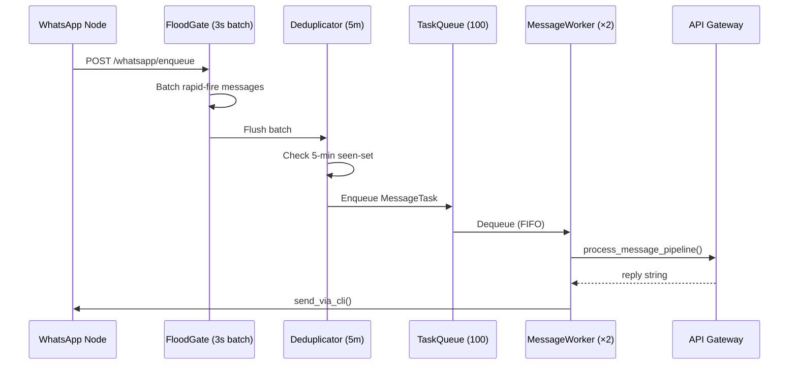
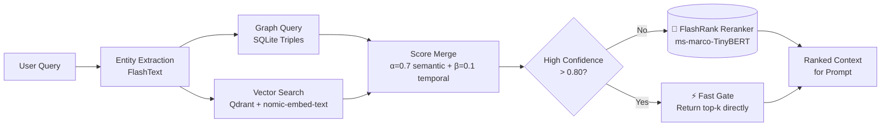
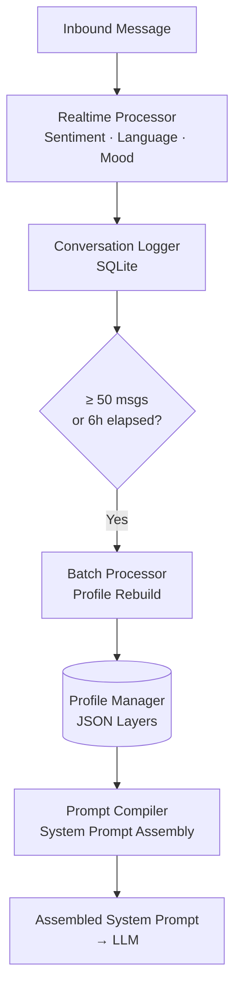
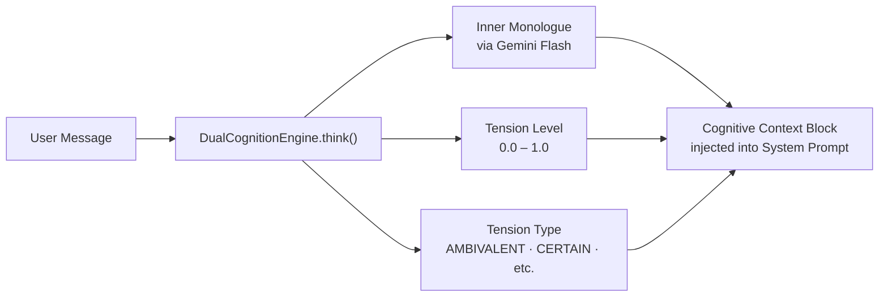
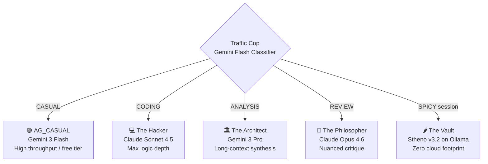
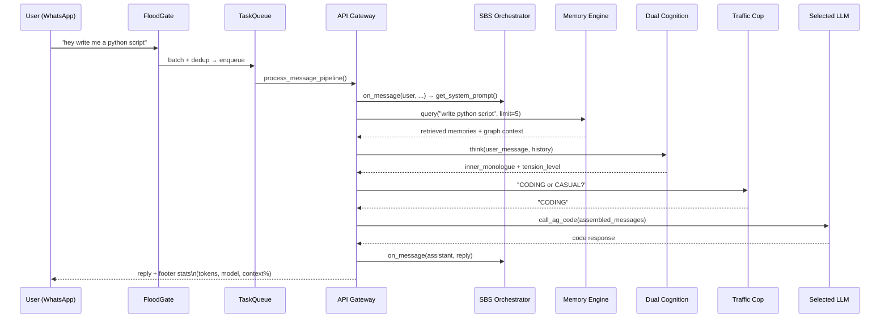

# 🧠 System Architecture — Project Phoenix

> A deep-dive into the modular, decentralized, and self-evolving design of JARVIS.

GitHub automatically renders the Mermaid diagrams below. If you are viewing this locally, use a Markdown viewer that supports Mermaid.js, or view it on GitHub.

---

## Architecture Diagram


> *Full interactive diagram with annotations is available in the [Figma file](https://www.figma.com/@upayan). The sections below break down each subsystem in detail.*

---

## High-Level System Map

This diagram illustrates the full end-to-end flow: from user input, through the Async Gateway Pipeline, across the Cognitive Engine (MoA + Dual Cognition), and back out as a response.

```mermaid
graph TD
    %% ── Styling ──────────────────────────────────────────────────────────────
    classDef user      fill:#2d3436,stroke:#74b9ff,stroke-width:2px,color:#fff
    classDef gateway   fill:#0984e3,stroke:#74b9ff,stroke-width:3px,color:#fff
    classDef async     fill:#00cec9,stroke:#81ecec,stroke-width:2px,color:#000
    classDef memory    fill:#00b894,stroke:#55efc4,stroke-width:2px,color:#fff
    classDef sbs       fill:#fdcb6e,stroke:#f39c12,stroke-width:2px,color:#000
    classDef moa       fill:#6c5ce7,stroke:#a29bfe,stroke-width:2px,color:#fff
    classDef local     fill:#d63031,stroke:#ff7675,stroke-width:2px,color:#fff

    %% ── Ingress ──────────────────────────────────────────────────────────────
    U1[📱 WhatsApp Webhook\nNode Gateway]:::user -->|HTTP POST /webhook| FG
    U2[💻 OpenClaw CLI\nProxy Request]:::user   -->|CLI Proxy| G

    %% ── Async Pipeline ───────────────────────────────────────────────────────
    subgraph Async_Pipeline [Async Gateway Pipeline]
        FG{🛡️ FloodGate\nBatch Window 3s}:::async
        DD[🔁 MessageDeduplicator\n5-min window]:::async
        Q[(📦 TaskQueue\nmax 100)]:::async
        W[⚙️ MessageWorker\n2 concurrent]:::async
        FG --> DD --> Q --> W
    end
    W --> G

    %% ── Core Gateway ─────────────────────────────────────────────────────────
    G((🚀 Core API Gateway\nFastAPI / Uvicorn\n:8000)):::gateway

    %% ── Soul-Brain Sync (SBS) ────────────────────────────────────────────────
    subgraph SBS [Soul-Brain Sync — Persona Engine]
        SBS_O[🎭 SBS Orchestrator\nthe_creator / the_partner]:::sbs
        SBS_P[📋 Profile Manager\nMood · Vocab · Sentiment]:::sbs
        SBS_L[📝 Conversation Logger\nSQLite per-session]:::sbs
        SBS_RT[⚡ Realtime Processor\nSentiment · Language · Mood]:::sbs
        SBS_B[🔄 Batch Processor\nEvery 50 msgs or 6h]:::sbs
        SBS_C[🖊️ Prompt Compiler\nSystem Prompt Assembly]:::sbs
        G <-->|Inject Persona Context| SBS_O
        SBS_O --- SBS_P --- SBS_L
        SBS_O --- SBS_RT --- SBS_B
        SBS_O --- SBS_C
    end

    %% ── Memory Subsystem ─────────────────────────────────────────────────────
    subgraph Cognitive_Memory [Cognitive Memory — Hybrid RAG]
        ME[🧠 Memory Engine\nHybrid Retrieval v3]:::memory
        M1[("🗃️ SQLite Graph DB\nTriples · knowledge_graph.db")]:::memory
        M2[(🔷 Qdrant Vector DB\nnomic-embed-text\n:6333)]:::memory
        RE[("🏅 FlashRank Reranker\nms-marco-TinyBERT")]:::memory
        G <-->|Semantic + Graph Query| ME
        ME <--> M1
        ME <--> M2
        ME --> RE
    end

    %% ── Dual Cognition ───────────────────────────────────────────────────────
    subgraph Dual_Cognition [Dual Cognition Engine]
        DC[🧩 DualCognitionEngine\nInner Monologue · Tension Calc]:::memory
        TS[☣️ LazyToxicScorer\nidle timeout 30s]:::memory
        G --> DC
        DC --- TS
    end

    %% ── Mixture of Agents ────────────────────────────────────────────────────
    subgraph Mixture_of_Agents [Mixture of Agents — MoA Router]
        TC{🚦 Traffic Cop\nIntent Classifier}:::moa
        G -->|Classify Intent| TC

        TC -->|CASUAL| LLM1[🟢 Gemini 3 Flash\nAG_CASUAL\nFast · Low Cost]:::moa
        TC -->|CODING| LLM2[("💻 The Hacker\nClaude Sonnet 4.5\nHigh Logic")]:::moa
        TC -->|ANALYSIS| LLM3[🏛️ The Architect\nGemini 3 Pro\nDeep Synthesis]:::moa
        TC -->|REVIEW| LLM4[("🧐 The Philosopher\nClaude Opus 4.6\nCritique · Judgment")]:::moa
        TC -->|SPICY / Private| LLM5[("🌶️ The Vault\nLocal Stheno on Ollama\nZero Cloud Leakage")]:::local
    end

    %% ── Return Path ──────────────────────────────────────────────────────────
    LLM1 & LLM2 & LLM3 & LLM4 & LLM5 -->|Response + Footer Stats| G
    G -->|Auto-Continue if cut-off| AC[✂️ Auto-Continue\nBackground Task]:::async
    G -->|Final Output| U1
    G -->|Final Output| U2
```



---

## Component Breakdown

### 1. 📱 Ingress Layer

| Input Channel | Transport | Handler |
|---|---|---|
| WhatsApp (via Node Gateway) | HTTP POST `/webhook` | `FloodGate` → `Deduplicator` → `TaskQueue` |
| OpenClaw CLI | CLI Proxy subprocess | Direct → `Core API Gateway` |

### 2. ⚙️ Async Gateway Pipeline (`workspace/sci_fi_dashboard/gateway/`)

Messages from WhatsApp enter an asynchronous multi-stage pipeline **before** hitting the cognitive engine. This prevents webhook timeouts and ensures ordered, deduplicated processing.



| File | Role |
|---|---|
| `gateway/queue.py` | `TaskQueue` — asyncio-based FIFO, max 100 tasks |
| `gateway/flood.py` | `FloodGate` — batches messages within a 3-second window |
| `gateway/dedup.py` | `MessageDeduplicator` — 5-minute seen-set for exact deduplication |
| `gateway/worker.py` | `MessageWorker` — 2 concurrent async workers consuming the queue |
| `gateway/sender.py` | `WhatsAppSender` — wraps the OpenClaw CLI `send` command |

---

### 3. 🚀 Core API Gateway (`api_gateway.py`)

The central FastAPI application running on **port 8000**. Every cognitive operation is orchestrated from here.

**API Routes:**

| Method | Route | Description |
|---|---|---|
| `POST` | `/chat/the_creator` | Chat endpoint for primary user (brother mode) |
| `POST` | `/chat/the_partner` | Chat endpoint for partner (caring PA mode) |
| `POST` | `/chat` | Generic fallback (Banglish persona) |
| `POST` | `/whatsapp/enqueue` | Async WhatsApp ingress entry point |
| `GET`  | `/whatsapp/status/{id}` | Poll status of an enqueued message |
| `POST` | `/persona/rebuild` | Re-parse chat logs and rebuild persona profiles |
| `GET`  | `/persona/status` | Profile statistics and embedding mode |
| `POST` | `/ingest` | Ingest a structured fact into the knowledge graph |
| `POST` | `/add` | Unstructured memory → LLM → triple extraction |
| `POST` | `/query` | Query the knowledge graph |
| `GET`  | `/health` | System health check |
| `GET`  | `/v1/models` | OpenAI-compatible model list (for Node Gateway discovery) |
| `POST` | `/v1/chat/completions` | OpenAI-compatible proxy endpoint |

**Singleton Modules (initialized once at boot):**

```python
brain          = SQLiteGraph()           # Knowledge graph
gate           = EntityGate(...)         # FlashText keyword extractor
conflicts      = ConflictManager(...)    # Conflict deduplication
toxic_scorer   = LazyToxicScorer(...)    # Lazy-loaded toxicity scorer
memory_engine  = MemoryEngine(...)       # Hybrid RAG engine
dual_cognition = DualCognitionEngine(...)# Inner monologue engine
```

---

### 4. 🧠 Cognitive Memory — Hybrid RAG (`memory_engine.py`, `sqlite_graph.py`, `retriever.py`)

Three-tier retrieval engine that provides grounded memory context before any LLM call.



| Store | Technology | Port | Purpose |
|---|---|---|---|
| `memory.db` | SQLite | local file | Document store & embedding queue |
| `knowledge_graph.db` | SQLite (graph) | local file | Subject–Predicate–Object triple store |
| Qdrant | Qdrant (native binary) | `:6333` | High-speed semantic vector search |

**Retrieval Tiers:**

1. **Fast Gate** — if ≥ `limit` results score > 0.80, return immediately (no reranker overhead).
2. **Reranked** — `FlashRank` (ms-marco-TinyBERT-L-2-v2) re-scores all Qdrant candidates for higher precision.

**Temporal Routing:**

- Queries containing words like `"was"`, `"history"`, `"2024"` → `β=0.0` (pure semantic, no recency boost).
- Queries containing `"current"`, `"now"`, `"today"` → `β=0.5` (blend recency with semantic).
- Default → `β=0.1` (mild recency nudge).

---

### 5. 🎭 Soul-Brain Sync (SBS) Persona Engine (`sbs/`)

The SBS system is responsible for making JARVIS feel like a person, not a chatbot. It continuously tracks and evolves a structured **persona profile** for each conversation target in real-time.



**Profile Layers tracked per target:**

| Layer | Data captured |
|---|---|
| `emotional_state` | Dominant mood, sentiment average, mood trajectory |
| `linguistic` | Banglish ratio, formality index, language mix |
| `vocabulary` | Unique word count, preferred phrases, emoji frequency |
| `meta` | Total messages processed, last batch run timestamp, profile version |

**Two SBS instances run simultaneously:**
- `sbs_the_creator` — tuned for primary user (casual, direct, sibling-like)
- `sbs_the_partner` — tuned for the partner (warm, supportive, PA-like)

---

### 6. 🧩 Dual Cognition Engine (`dual_cognition.py`)

Before generating a reply, JARVIS thinks. The `DualCognitionEngine` generates an **inner monologue** and calculates a **tension level** to decide if there is emotional conflict between the retrieved memory and the current user request.



The `LazyToxicScorer` is loaded alongside DualCognition. It auto-unloads after **30 seconds of idle** to save RAM — critical for a Mac Air host.

---

### 7. 🚦 Mixture of Agents (MoA) Router

The **Traffic Cop** classifies every user message before routing it to the appropriate specialist model.



All cloud models route through the **Antigravity Proxy** (`localhost:8080`) using an OAuth token. The vault (Stheno) connects directly to a Windows PC Ollama instance (`WINDOWS_PC_IP:11434`).

**Model constants (configurable via env):**

| Constant | Default Model |
|---|---|
| `MODEL_CASUAL` | `gemini-3-flash` |
| `MODEL_CODING` | `gemini-3-flash` *(placeholder — Claude on credit restore)* |
| `MODEL_ANALYSIS` | `gemini-3-pro-high` |
| `MODEL_REVIEW` | `gemini-3-pro-high` *(placeholder — Opus on credit restore)* |

---

### 8. ✂️ Auto-Continue System

If JARVIS is cut off mid-sentence (no terminal punctuation at end of reply), a **FastAPI BackgroundTask** is spawned to:
1. Append the truncated reply to message history.
2. Ask the model to "continue exactly from where you stopped."
3. Push the continuation via `send_via_cli()` as a second message to the user.

---

### 9. 🛡️ Sentinel (`sbs/sentinel/`)

A file-governance module that runs at boot. It enforces structural rules on the workspace — preventing accidental writes to protected paths and logging file events for audit.

---

### 10. 👷 Gentle Worker Loop

A background async loop that runs every **10 minutes** (when plugged in and CPU < 20%) to:
- `brain.prune_graph()` — Remove low-confidence or stale knowledge triples.
- `conflicts.prune_conflicts()` — Deduplicate conflict entries in the conflict graph.

---

## Service Port Map

| Service | Port | Technology |
|---|---|---|
| Core API Gateway | `8000` | FastAPI / Uvicorn |
| Antigravity Proxy (OAuth) | `8080` | OpenClaw built-in |
| Qdrant Vector DB | `6333` | Qdrant (OrbStack container) |
| Ollama (Mac — embeddings) | `11434` | Ollama |
| Ollama (Windows PC — Vault) | `11434` | Ollama (remote) |

---

## Data Flow: One Full Request (Happy Path)



---

## Repository Layout (Key Files)

```
workspace/
├── sci_fi_dashboard/
│   ├── api_gateway.py          # Core FastAPI app (1,188 lines)
│   ├── memory_engine.py        # Hybrid RAG engine
│   ├── sqlite_graph.py         # SQLite knowledge graph
│   ├── toxic_scorer_lazy.py    # Lazy-loaded toxicity scorer
│   ├── dual_cognition.py       # Inner monologue engine
│   ├── retriever.py            # Qdrant + reranker utilities
│   ├── persona.py              # Persona loading helpers
│   ├── build_persona.py        # Static persona builder
│   ├── conflict_resolver.py    # Conflict graph manager
│   ├── smart_entity.py         # FlashText entity gate
│   ├── state.py                # Runtime state container
│   ├── gateway/                # Async pipeline (queue, flood, dedup, worker, sender)
│   └── sbs/                    # Soul-Brain Sync persona engine
│       ├── orchestrator.py     # Top-level SBS coordinator
│       ├── ingestion/          # ConversationLogger + RawMessage schema
│       ├── processing/         # Realtime + Batch processors
│       ├── profile/            # ProfileManager (JSON layer store)
│       ├── injection/          # PromptCompiler
│       └── sentinel/           # File governance
└── db/
    ├── model_orchestrator.py   # Standalone model routing helper
    ├── async_worker.py         # DB-layer async worker
    └── ingest.py               # Fact ingestion pipeline
```

---

## Design Principles

| Principle | Implementation |
|---|---|
| **Zero-duplication singletons** | All core engines (graph, memory, toxicity) initialized once and shared |
| **Async-first** | Full asyncio stack; no blocking calls in the hot path |
| **Memory-optimized** | LazyToxicScorer auto-unloads; `OLLAMA_KEEP_ALIVE=0`; graph/conflict pruning on idle |
| **Zero cloud leakage for private sessions** | Spicy / private tasks routed to local Ollama Vault; never to cloud APIs |
| **Self-evolving persona** | SBS batch processor continuously rebuilds personality profile from conversation history |
| **Cost-aware routing** | Traffic Cop prevents simple greetings from hitting expensive models |
| **Resilient delivery** | Auto-Continue catches cut-off responses and pushes continuations asynchronously |
