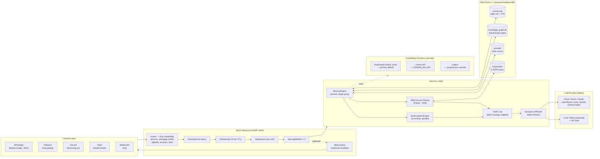
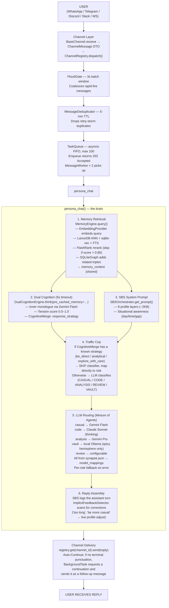
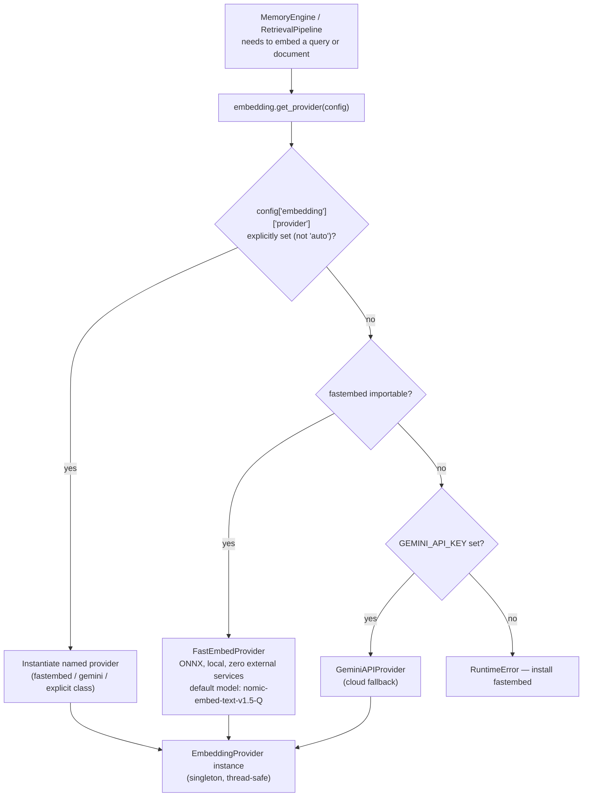
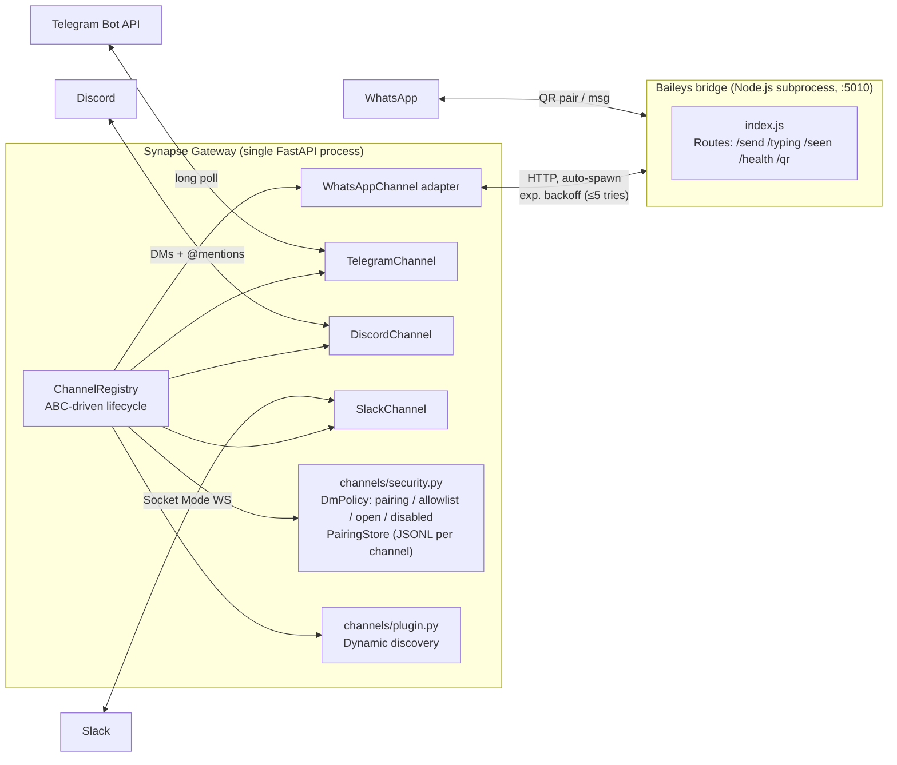
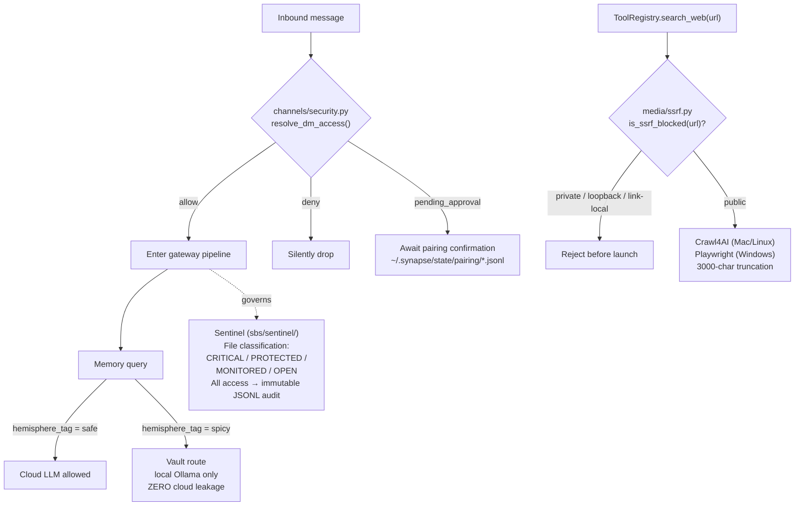

# Synapse-OSS Architecture (v3.0)

> How a message travels from the user's phone to a personalized AI reply — and what happens in the background to make that reply better over time.

This document reflects the `main` branch after the v3.0 production sync. The gateway has been split into modular route packages, embeddings are now a pluggable provider layer (FastEmbed-first, zero external services), and Docker has been retired in favor of a fully embedded runtime (LanceDB + SQLite).

---

## Diagram 1: System Components (high-level)

```mermaid
flowchart LR
    subgraph CH["Channel Layer"]
        WA["WhatsApp<br/>(Baileys bridge, :5010)"]
        TG["Telegram<br/>(long polling)"]
        DC["Discord<br/>(discord.py v2)"]
        SL["Slack<br/>(Socket Mode)"]
        WS["WebSocket<br/>(/ws)"]
    end

    subgraph GW["Async Gateway (FastAPI :8000)"]
        ROUTES["routes/ — chat, knowledge,<br/>persona, whatsapp, health,<br/>pipeline, sessions, skills"]
        FLOOD["FloodGate (3s batch)"]
        DEDUP["Deduplicator (5-min TTL)"]
        QUEUE["TaskQueue (max 100)"]
        WORKERS["MessageWorker × 2"]
        RETRY["Retry Queue<br/>(outbound durability)"]
    end

    subgraph BRAIN["persona_chat()"]
        MEM["MemoryEngine<br/>(shared, single query)"]
        DC2["DualCognitionEngine<br/>(5s timeout, parallel)"]
        SBS["SBS Persona Prompt<br/>(8-layer, ~2KB)"]
        COP["Traffic Cop<br/>(skip if strategy mapped)"]
        ROUTER["SynapseLLMRouter<br/>(litellm.Router)"]
    end

    subgraph DATA["Data Stores (~/.synapse/workspace/db/)"]
        MDB[("memory.db<br/>sqlite-vec + FTS")]
        KG[("knowledge_graph.db<br/>SQLiteGraph triples")]
        LDB[("lancedb/<br/>ANN vectors")]
        SBS_DB[("sbs/profiles/<br/>8 JSON layers")]
    end

    subgraph EMBED["Embedding Providers (cascade)"]
        FAST["FastEmbed (ONNX, local)<br/>— primary, default"]
        GEM["Gemini API<br/>— if GEMINI_API_KEY"]
        EXP["Explicit<br/>— synapse.json override"]
    end

    subgraph LLM["LLM Providers (litellm)"]
        CLOUD["Cloud: Gemini, Claude,<br/>OpenRouter, Groq, OpenAI,<br/>GitHub Copilot"]
        LOCAL["Local: Ollama (optional)<br/>— the Vault"]
    end

    CH --> ROUTES
    ROUTES --> FLOOD --> DEDUP --> QUEUE --> WORKERS
    WORKERS --> BRAIN
    MEM --> DC2
    MEM --> SBS
    SBS --> COP
    DC2 --> COP
    COP --> ROUTER
    ROUTER --> CLOUD
    ROUTER --> LOCAL
    MEM <--> MDB
    MEM <--> LDB
    MEM <--> KG
    SBS <--> SBS_DB
    MEM -.uses.-> EMBED
    WORKERS -.outbound.-> RETRY
    RETRY --> CH
```

---

## Diagram 2: Message Lifecycle (one user message → reply)

```mermaid
flowchart TD
    U["USER<br/>(WhatsApp / Telegram / Discord / Slack / WS)"] --> CL

    CL["Channel Layer<br/>BaseChannel.receive → ChannelMessage DTO<br/>→ ChannelRegistry.dispatch()"] --> FG

    FG["FloodGate — 3s batch window<br/>Coalesces rapid-fire messages"] --> DD

    DD["MessageDeduplicator — 5-min TTL<br/>Drops retry-storm duplicates"] --> TQ

    TQ["TaskQueue — asyncio FIFO, max 100<br/>Enqueue returns 202 Accepted<br/>MessageWorker × 2 picks up"] --> PC

    subgraph PC_SUB["persona_chat() — the brain"]
        direction TB
        M1["1. Memory Retrieval<br/>MemoryEngine.query()<br/>— EmbeddingProvider embeds query<br/>— LanceDB ANN + sqlite-vec + FTS<br/>— FlashRank rerank (skip if score > 0.80)<br/>— SQLiteGraph adds related triples<br/>→ memory_context (shared)"]
        M2["2. Dual Cognition (5s timeout)<br/>DualCognitionEngine.think(pre_cached_memory=…)<br/>— Inner monologue via Gemini Flash<br/>— Tension score 0.0–1.0<br/>— CognitiveMerge: response_strategy"]
        M3["3. SBS System Prompt<br/>SBSOrchestrator.get_prompt()<br/>— 8 profile layers (~2KB)<br/>— Situational awareness (day/time/gap)"]
        M4["4. Traffic Cop<br/>If CognitiveMerge has a known strategy<br/>(be_direct / analytical / explore_with_care)<br/>→ SKIP classifier, map directly to role<br/>Otherwise → LLM classifies<br/>(CASUAL / CODE / ANALYSIS / REVIEW / VAULT)"]
        M5["5. LLM Routing (Mixture of Agents)<br/>casual → Gemini Flash<br/>code → Claude Sonnet (thinking)<br/>analysis → Gemini Pro<br/>vault → local Ollama (spicy hemisphere only)<br/>review → configurable<br/>All from synapse.json → model_mappings<br/>Per-role fallback on error"]
        M6["6. Reply Assembly<br/>SBS logs the assistant turn<br/>ImplicitFeedbackDetector scans for corrections<br/>('too long', 'be more casual' → live profile adjust)"]

        M1 --> M2
        M1 --> M3
        M2 --> M4
        M3 --> M4
        M4 --> M5 --> M6
    end

    PC[persona_chat] --> PC_SUB
    PC_SUB --> DEL

    DEL["Channel Delivery<br/>registry.get(channel_id).send(reply)<br/>Auto-Continue: if no terminal punctuation,<br/>BackgroundTask requests a continuation and<br/>sends it as a follow-up message"] --> U2["USER RECEIVES REPLY"]
```

**Key timing**: FloodGate batch (3s) + Memory (<350ms P95) + Dual Cognition (2–5s, skippable via config) + LLM (1–3s) ≈ **4–10s end-to-end**.

---

## Diagram 3: Background Tasks

```mermaid
flowchart TD
    subgraph T1["Trigger: EVERY message"]
        RT["SBS RealtimeProcessor<br/>— sentiment + language detection<br/>— vocabulary tracking<br/>— ImplicitFeedbackDetector<br/>  (patterns from sbs/feedback/language_patterns.yaml)"]
    end

    subgraph T2["Trigger: /new (session reset)"]
        SI["session_ingest.py — asyncio.create_task()<br/>Archived transcript → batches of 5 turns"]
        VEC["Vector Ingestion<br/>MemoryEngine.add_memory()<br/>EmbeddingProvider encode → LanceDB<br/>+ sqlite-vec write"]
        KGX["KG Extraction<br/>ConvKGExtractor.extract() via LLM<br/>Anti-hallucination: triples must be<br/>grounded in the source text"]
        TW["Triple writes<br/>SQLiteGraph.add_relation()<br/>+ entity_links in memory.db"]
        SL["Sleep 1s between batches<br/>(rate-limit safety)"]
        SI --> VEC
        SI --> KGX --> TW
        VEC --> SL
        TW --> SL
    end

    subgraph T3["Trigger: every 50 messages OR 6h idle"]
        BP["SBS BatchProcessor<br/>— distills 8 profile layers<br/>  (core_identity, linguistic, emotional_state,<br/>   domain, interaction, vocabulary,<br/>   exemplars, meta)<br/>— rebuilds ~2KB behavioral profile<br/>— archives previous version"]
    end

    subgraph T4["Trigger: GentleWorker — only if CPU < 20% AND plugged in"]
        GW10["Every 10 min<br/>Prune stale / low-confidence KG triples"]
        GW30["Every 30 min<br/>VACUUM memory.db + knowledge_graph.db"]
        GW10 --> GW30
    end

    subgraph T5["Trigger: CronService (optional)"]
        CR["Reads &lt;data_root&gt;/cron/jobs.json<br/>— proactive check-ins<br/>— scheduled persona_chat() calls<br/>— system local timezone<br/>— opt-in per job, disabled by default"]
    end

    subgraph DS["Data stores (where everything lands)"]
        DS1["~/.synapse/workspace/db/memory.db<br/>SQLite + sqlite-vec<br/>(documents, embeddings, entity_links)"]
        DS2["~/.synapse/workspace/db/knowledge_graph.db<br/>SQLiteGraph (subject-predicate-object)"]
        DS3["~/.synapse/workspace/db/lancedb/<br/>LanceDB tables (ANN vectors)"]
        DS4["~/.synapse/workspace/sci_fi_dashboard/synapse_data/<br/>sbs_&lt;persona&gt;/profiles/ — 8 JSON layers"]
    end

    T1 --> DS4
    T2 --> DS1
    T2 --> DS2
    T2 --> DS3
    T3 --> DS4
    T4 --> DS1
    T4 --> DS2
```

All background work is async. None of it blocks the chat pipeline.

---

## Diagram 4: Embedding Provider Cascade

```mermaid
flowchart TD
    Q["MemoryEngine / RetrievalPipeline<br/>needs to embed a query or document"]
    GP["embedding.get_provider(config)"]
    Q --> GP

    GP --> C1{"config['embedding']['provider']<br/>explicitly set (not 'auto')?"}
    C1 -- "yes" --> EXP["Instantiate named provider<br/>(fastembed / gemini / explicit class)"]
    C1 -- "no" --> C2{"fastembed importable?"}
    C2 -- "yes" --> FE["FastEmbedProvider<br/>ONNX, local, zero external services<br/>default model: nomic-embed-text-v1.5-Q"]
    C2 -- "no" --> C3{"GEMINI_API_KEY set?"}
    C3 -- "yes" --> GM["GeminiAPIProvider<br/>(cloud fallback)"]
    C3 -- "no" --> ERR["RuntimeError — install fastembed"]

    EXP --> OUT["EmbeddingProvider instance<br/>(singleton, thread-safe)"]
    FE --> OUT
    GM --> OUT
```

Vector dimensions are read from the provider at runtime, so schema adapts to whichever model is configured.

---

## Diagram 5: Channel Layer + Baileys Subprocess

```mermaid
flowchart LR
    subgraph APP["Synapse Gateway (single FastAPI process)"]
        CR["ChannelRegistry<br/>ABC-driven lifecycle"]
        WA_AD["WhatsAppChannel adapter"]
        TG_AD["TelegramChannel"]
        DC_AD["DiscordChannel"]
        SL_AD["SlackChannel"]
        SEC["channels/security.py<br/>DmPolicy: pairing / allowlist / open / disabled<br/>PairingStore (JSONL per channel)"]
        PLUGIN["channels/plugin.py<br/>Dynamic discovery"]
        CR --> WA_AD
        CR --> TG_AD
        CR --> DC_AD
        CR --> SL_AD
        CR --> SEC
        CR --> PLUGIN
    end

    subgraph BB["Baileys bridge (Node.js subprocess, :5010)"]
        BRIDGE["index.js<br/>Routes: /send /typing /seen /health /qr"]
    end

    WA_AD <-- "HTTP, auto-spawn<br/>exp. backoff (≤5 tries)" --> BB

    WA["WhatsApp"] <-- "QR pair / msg" --> BB
    TG["Telegram Bot API"] <-- long poll --> TG_AD
    DC["Discord"] <-- "DMs + @mentions" --> DC_AD
    SL["Slack"] <-- "Socket Mode WS" --> SL_AD
```

The Baileys bridge is the only non-Python component. It is spawned and supervised by `WhatsAppChannel`, restarts on crash with exponential backoff (up to 5 attempts, 5-second initial delay), and is never a manually-started service.

---

## Diagram 6: Security Boundaries

```mermaid
flowchart TD
    INBOUND["Inbound message"] --> DM_CHK{"channels/security.py<br/>resolve_dm_access()"}
    DM_CHK -- "allow" --> PIPE["Enter gateway pipeline"]
    DM_CHK -- "deny" --> DROP["Silently drop"]
    DM_CHK -- "pending_approval" --> PAIR["Await pairing confirmation<br/>~/.synapse/state/pairing/*.jsonl"]

    PIPE --> MEMQ["Memory query"]
    MEMQ -- "hemisphere_tag = safe" --> CLOUD_OK["Cloud LLM allowed"]
    MEMQ -- "hemisphere_tag = spicy" --> VAULT["Vault route<br/>local Ollama only<br/>ZERO cloud leakage"]

    SENT["Sentinel (sbs/sentinel/)<br/>File classification:<br/>CRITICAL / PROTECTED /<br/>MONITORED / OPEN<br/>All access → immutable JSONL audit"]
    PIPE -.governs.-> SENT

    WEB["ToolRegistry.search_web(url)"] --> SSRF{"media/ssrf.py<br/>is_ssrf_blocked(url)?"}
    SSRF -- "private / loopback / link-local" --> REJECT["Reject before launch"]
    SSRF -- "public" --> BROWSER["Crawl4AI (Mac/Linux)<br/>Playwright (Windows)<br/>3000-char truncation"]
```

Three independent boundaries:

1. **DM access control** — every inbound message hits `DmPolicy` before entering the queue.
2. **Memory hemispheres** — `safe` vs `spicy` are physically partitioned; the Vault role is the only route that ever touches `spicy`.
3. **SSRF guard** — every URL the AI tries to browse is checked against private/loopback/link-local ranges before a browser is launched.

---

## Plain-English Summary

### Message flow
User sends a message → channel adapter normalizes it → FloodGate batches rapid-fire input → deduplicator drops retries → async queue hands it to a worker → `persona_chat()` runs memory retrieval once, hands results to Dual Cognition *and* the SBS prompt compiler, routes to the right LLM, and sends the reply back through the same channel.

### Background work
After every `/new` (session reset) the archived transcript is ingested into both the vector store and the knowledge graph in 5-turn batches. The SBS realtime processor fires on every message; its batch counterpart fires every 50 messages (or 6 hours idle) to rebuild the 2 KB behavioral profile. A gentle background worker prunes stale triples and vacuums databases, but only when the host is plugged in and the CPU is quiet.

### Dependencies (v3.0)
- **Required**: Python 3.11, SQLite (with sqlite-vec), LanceDB (embedded).
- **Embeddings**: FastEmbed (ONNX, local, default) or Gemini API. Ollama embeddings are no longer required.
- **Optional**: Ollama (only if you use the Vault role for local inference), any cloud LLM provider key (Gemini / Claude / OpenRouter / Groq / OpenAI / GitHub Copilot).
- **Zero Docker.** Zero external services required for the default cascade — the minimum viable Synapse runs entirely on a laptop.
