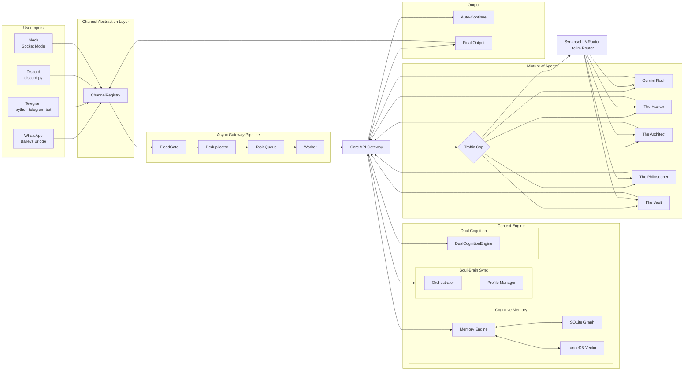
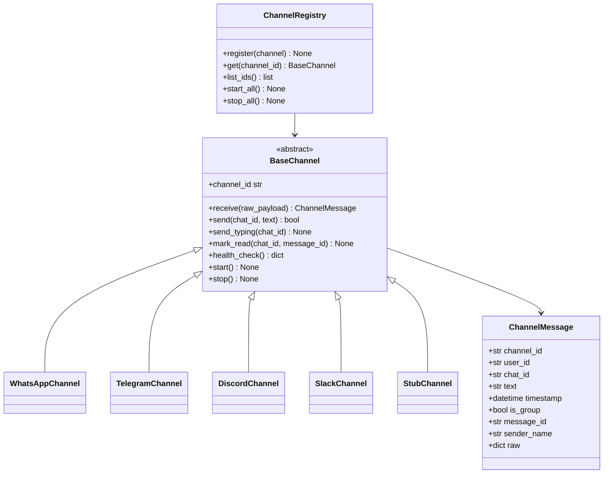
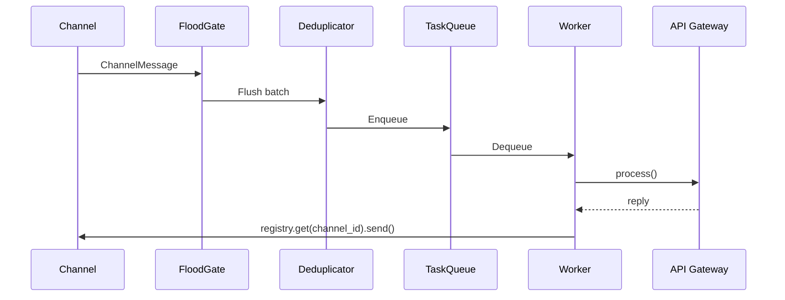
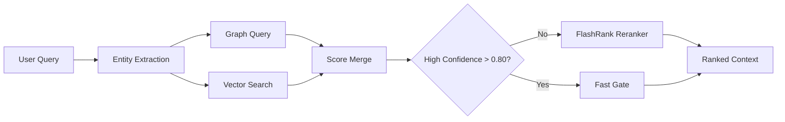
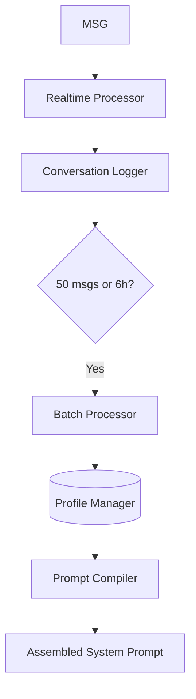
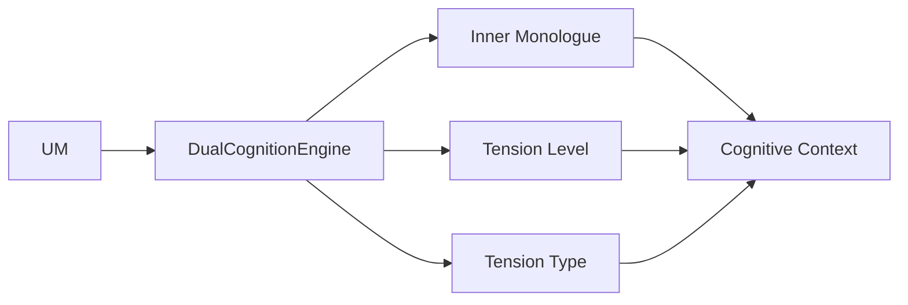
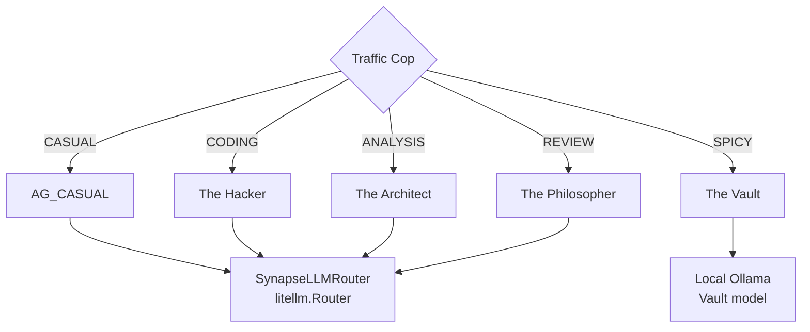
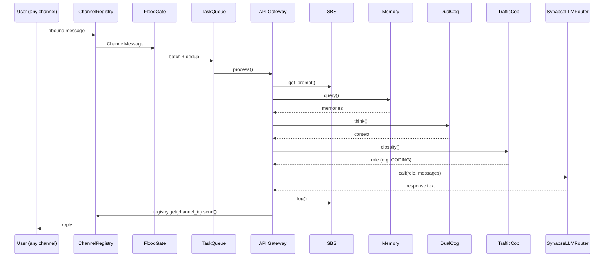

# System Architecture — Project Phoenix

> A deep-dive into the modular, decentralized, and self-evolving design of JARVIS.

GitHub automatically renders the Mermaid diagrams below. If you are viewing this locally, use a Markdown viewer that supports Mermaid.js, or view it on GitHub.

## High-Level System Map

This diagram illustrates the full end-to-end flow: from user input across multiple channels, through the Channel Abstraction Layer and Async Gateway Pipeline, across the Cognitive Engine (MoA + Dual Cognition), and back out as a response.


```mermaid
flowchart LR
    subgraph Inputs[User Inputs]
        WA[WhatsApp\nBaileys Bridge]
        TG[Telegram\npython-telegram-bot]
        DS[Discord\ndiscord.py]
        SL[Slack\nSocket Mode]
    end

    subgraph CR[Channel Abstraction Layer]
        REG[ChannelRegistry]
    end

    subgraph Async[Async Gateway Pipeline]
        direction TB
        FG[FloodGate]
        DD[Deduplicator]
        Q[Task Queue]
        W[Worker]
        FG --> DD --> Q --> W
    end

    G[Core API Gateway]

    subgraph Brain[Context Engine]
        direction TB
        subgraph SBS[Soul-Brain Sync]
            direction LR
            SBS_O[Orchestrator] --- SBS_P[Profile Manager]
        end
        subgraph Mem[Cognitive Memory]
            ME[Memory Engine]
            ME <--> M1[SQLite Graph]
            ME <--> M2[LanceDB Vector]
        end
        subgraph DC[Dual Cognition]
            DCE[DualCognitionEngine]
        end
    end

    subgraph MoA[Mixture of Agents]
        TC{Traffic Cop}
        LLM1[Gemini Flash]
        LLM2[The Hacker]
        LLM3[The Architect]
        LLM4[The Philosopher]
        LLM5[The Vault]
        TC --> LLM1
        TC --> LLM2
        TC --> LLM3
        TC --> LLM4
        TC --> LLM5
    end

    ROUTER[SynapseLLMRouter\nlitellm.Router]

    subgraph Out[Output]
        AC[Auto-Continue]
        FO[Final Output]
    end

    WA --> REG
    TG --> REG
    DS --> REG
    SL --> REG
    REG --> FG
    W --> G
    G <--> SBS
    G <--> ME
    G --> DCE
    G --> TC
    TC --> ROUTER
    ROUTER --> LLM1 & LLM2 & LLM3 & LLM4 & LLM5
    LLM1 & LLM2 & LLM3 & LLM4 & LLM5 --> G
    G --> AC
    G --> FO
    FO --> REG
```

---

## Component Breakdown

### 1. Ingress Layer

| Input Channel    | Transport                                  | Handler                                        |
| ---------------- | ------------------------------------------ | ---------------------------------------------- |
| WhatsApp         | Baileys Node.js bridge HTTP (port 5010)    | `WhatsAppChannel` → `ChannelRegistry`        |
| Telegram         | python-telegram-bot long polling           | `TelegramChannel` → `ChannelRegistry`        |
| Discord          | discord.py 2.x `await client.start()`     | `DiscordChannel` → `ChannelRegistry`         |
| Slack            | slack-bolt Socket Mode WebSocket           | `SlackChannel` → `ChannelRegistry`           |

All channels normalize their inbound payloads into a unified `ChannelMessage` dataclass before anything enters the async pipeline. Outbound replies are dispatched back through the same channel via `registry.get(channel_id).send()` — no per-channel branching in the worker or gateway.

---

### 2. Channel Abstraction Layer (`workspace/sci_fi_dashboard/channels/`)

A uniform adapter interface that decouples the cognitive engine from transport-specific details. Adding a new messaging platform requires only a new `BaseChannel` subclass — no changes to the pipeline or gateway.


```mermaid
classDiagram
    class ChannelMessage {
        +str channel_id
        +str user_id
        +str chat_id
        +str text
        +datetime timestamp
        +bool is_group
        +str message_id
        +str sender_name
        +dict raw
    }

    class BaseChannel {
        <<abstract>>
        +channel_id str
        +receive(raw_payload) ChannelMessage
        +send(chat_id, text) bool
        +send_typing(chat_id) None
        +mark_read(chat_id, message_id) None
        +health_check() dict
        +start() None
        +stop() None
    }

    class ChannelRegistry {
        +register(channel) None
        +get(channel_id) BaseChannel
        +list_ids() list
        +start_all() None
        +stop_all() None
    }

    BaseChannel <|-- WhatsAppChannel
    BaseChannel <|-- TelegramChannel
    BaseChannel <|-- DiscordChannel
    BaseChannel <|-- SlackChannel
    BaseChannel <|-- StubChannel
    ChannelRegistry --> BaseChannel
    BaseChannel --> ChannelMessage
```

| File                        | Class               | Transport detail                                                      |
| --------------------------- | ------------------- | --------------------------------------------------------------------- |
| `channels/base.py`        | `BaseChannel` ABC + `ChannelMessage` dataclass | Defines the contract all adapters must satisfy |
| `channels/registry.py`    | `ChannelRegistry`   | Registers adapters; `start_all()` / `stop_all()` manage lifecycle via `asyncio.create_task()` |
| `channels/whatsapp.py`    | `WhatsAppChannel`   | Spawns Baileys Node.js subprocess; supervises with exponential backoff (max 5 restarts); HTTP client via `httpx` |
| `channels/telegram.py`    | `TelegramChannel`   | python-telegram-bot v22+ long polling; manual `Updater` lifecycle; DMs + group @mentions |
| `channels/discord_channel.py` | `DiscordChannel` | discord.py v2.x; `await client.start()` (never `client.run()`); DMs + @mentions; requires `MESSAGE_CONTENT` privileged intent |
| `channels/slack.py`       | `SlackChannel`      | slack-bolt `AsyncApp` + `AsyncSocketModeHandler`; Socket Mode WebSocket (no public URL needed); `xoxb-` bot token + `xapp-` app token |
| `channels/stub.py`        | `StubChannel`       | No-op adapter for unit tests                                          |

**`ChannelRegistry` lifecycle (inside FastAPI lifespan):**

```python
registry = ChannelRegistry()
registry.register(WhatsAppChannel(...))
registry.register(TelegramChannel(...))
registry.register(DiscordChannel(...))
registry.register(SlackChannel(...))

@asynccontextmanager
async def lifespan(app: FastAPI):
    await registry.start_all()   # asyncio.create_task() per channel
    yield
    await registry.stop_all()    # cancel tasks, then call stop() on each
```

**`WhatsAppChannel` subprocess supervision:**

The adapter spawns `node baileys-bridge/index.js` with `BRIDGE_PORT=5010` and `PYTHON_WEBHOOK_URL` env vars. If the bridge crashes it is restarted with exponential backoff (0 s → 1 s → 2 s → 4 s → ... → 60 s cap, up to 5 attempts). All outbound calls (`/send`, `/typing`, `/seen`) and health queries (`/health`, `/qr`) go through `httpx.AsyncClient`.

---

### 3. Async Gateway Pipeline (`workspace/sci_fi_dashboard/gateway/`)

Messages from any channel enter an asynchronous multi-stage pipeline **before** hitting the cognitive engine. This prevents webhook timeouts and ensures ordered, deduplicated processing.


```mermaid
sequenceDiagram
    participant CH as Channel
    participant FG as FloodGate
    participant DD as Deduplicator
    participant Q as TaskQueue
    participant W as Worker
    participant G as API Gateway

    CH->>FG: ChannelMessage
    FG->>DD: Flush batch
    DD->>Q: Enqueue
    Q->>W: Dequeue
    W->>G: process()
    G-->>W: reply
    W->>CH: registry.get(channel_id).send()
```

| File                  | Role                                                                 |
| --------------------- | -------------------------------------------------------------------- |
| `gateway/queue.py`  | `TaskQueue` — asyncio-based FIFO, max 100 tasks                   |
| `gateway/flood.py`  | `FloodGate` — batches messages within a 3-second window           |
| `gateway/dedup.py`  | `MessageDeduplicator` — 5-minute seen-set for exact deduplication |
| `gateway/worker.py` | `MessageWorker` — 2 concurrent async workers consuming the queue  |
| `gateway/sender.py` | `WhatsAppSender` — sends outbound messages via the Baileys bridge HTTP API (`POST /send` to port 5010) |

---

### 4. Core API Gateway (`api_gateway.py`)

The central FastAPI application running on **port 8000**. Every cognitive operation is orchestrated from here.

**API Routes:**

| Method   | Route                          | Description                                               |
| -------- | ------------------------------ | --------------------------------------------------------- |
| `POST` | `/chat/the_creator`          | Chat endpoint for primary user (brother mode)             |
| `POST` | `/chat/the_partner`          | Chat endpoint for partner (caring PA mode)                |
| `POST` | `/chat`                      | Generic fallback (Banglish persona)                       |
| `POST` | `/whatsapp/enqueue`          | Async WhatsApp ingress entry point                        |
| `GET`  | `/whatsapp/status/{id}`      | Poll status of an enqueued message                        |
| `POST` | `/channels/whatsapp/webhook` | Inbound webhook from the Baileys bridge subprocess        |
| `POST` | `/persona/rebuild`           | Re-parse chat logs and rebuild persona profiles           |
| `GET`  | `/persona/status`            | Profile statistics and embedding mode                     |
| `POST` | `/ingest`                    | Ingest a structured fact into the knowledge graph         |
| `POST` | `/add`                       | Unstructured memory → LLM → triple extraction           |
| `POST` | `/query`                     | Query the knowledge graph                                 |
| `GET`  | `/health`                    | System health check                                       |
| `GET`  | `/v1/models`                 | OpenAI-compatible model list                              |
| `POST` | `/v1/chat/completions`       | OpenAI-compatible proxy endpoint                          |

**Singleton Modules (initialized once at boot):**

```python
brain          = SQLiteGraph()            # Knowledge graph
gate           = EntityGate(...)          # FlashText keyword extractor
conflicts      = ConflictManager(...)     # Conflict deduplication
toxic_scorer   = LazyToxicScorer(...)     # Lazy-loaded toxicity scorer
memory_engine  = MemoryEngine(...)        # Hybrid RAG engine
dual_cognition = DualCognitionEngine(...) # Inner monologue engine
llm_router     = SynapseLLMRouter(...)    # litellm.Router wrapper
registry       = ChannelRegistry()        # Channel adapter lifecycle manager
```

---

### 5. Cognitive Memory — Hybrid RAG (`memory_engine.py`, `sqlite_graph.py`, `retriever.py`)

Three-tier retrieval engine that provides grounded memory context before any LLM call.


```mermaid
graph LR
    Q[User Query] --> EE[Entity Extraction]
    EE --> GQ[Graph Query]
    EE --> VQ[Vector Search]
    GQ --> MERGE[Score Merge]
    VQ --> MERGE
    MERGE --> FG2{High Confidence > 0.80?}
    FG2 -->|Yes| FAST[Fast Gate]
    FG2 -->|No| RR[FlashRank Reranker]
    RR --> OUT[Ranked Context]
    FAST --> OUT
```

| Store                  | Technology             | Port       | Purpose                                 |
| ---------------------- | ---------------------- | ---------- | --------------------------------------- |
| `memory.db`          | SQLite                 | local file | Document store & embedding queue        |
| `knowledge_graph.db` | SQLite (graph)         | local file | Subject–Predicate–Object triple store |
| LanceDB                | LanceDB (embedded)     | local file | High-speed semantic vector search       |

**Retrieval Tiers:**

1. **Fast Gate** — if ≥ `limit` results score > 0.80, return immediately (no reranker overhead).
2. **Reranked** — `FlashRank` (ms-marco-TinyBERT-L-2-v2) re-scores all vector candidates for higher precision.

**Temporal Routing:**

- Queries containing words like `"was"`, `"history"`, `"2024"` → `β=0.0` (pure semantic, no recency boost).
- Queries containing `"current"`, `"now"`, `"today"` → `β=0.5` (blend recency with semantic).
- Default → `β=0.1` (mild recency nudge).

---

### 6. Soul-Brain Sync (SBS) Persona Engine (`sbs/`)

The SBS system is responsible for making JARVIS feel like a person, not a chatbot. It continuously tracks and evolves a structured **persona profile** for each conversation target in real-time.


```mermaid
graph TD
    MSG --> RT[Realtime Processor]
    RT --> LOG[Conversation Logger]
    LOG --> CNT{50 msgs or 6h?}
    CNT -->|Yes| BATCH[Batch Processor]
    BATCH --> PM[(Profile Manager)]
    PM --> PC[Prompt Compiler]
    PC --> SYS[Assembled System Prompt]
```

**Profile Layers tracked per target:**

| Layer               | Data captured                                                       |
| ------------------- | ------------------------------------------------------------------- |
| `emotional_state` | Dominant mood, sentiment average, mood trajectory                   |
| `linguistic`      | Banglish ratio, formality index, language mix                       |
| `vocabulary`      | Unique word count, preferred phrases, emoji frequency               |
| `meta`            | Total messages processed, last batch run timestamp, profile version |

**Two SBS instances run simultaneously:**

- `sbs_the_creator` — tuned for primary user (casual, direct, sibling-like)
- `sbs_the_partner` — tuned for the partner (warm, supportive, PA-like)

#### Implicit Feedback Detection (`sbs/feedback/`)

The `ImplicitFeedbackDetector` monitors every user message for conversational corrections — phrases like "too long", "be more casual", "stop being robotic". Detection phrases are loaded from `sbs/feedback/language_patterns.yaml` at startup, so users can add their own language patterns without editing Python. When a correction signal is detected:

1. The signal type is classified (formality, length, praise, rejection)
2. The corresponding profile layer is adjusted immediately (e.g., `primary_language_ratio += 0.2` on a "be less formal" signal)
3. The batch processor reinforces the adjustment on its next cycle

This allows the persona to adapt in real-time without explicit configuration commands.

---

### 7. Dual Cognition Engine (`dual_cognition.py`)

Before generating a reply, JARVIS thinks. The `DualCognitionEngine` generates an **inner monologue** and calculates a **tension level** to decide if there is emotional conflict between the retrieved memory and the current user request.


```mermaid
graph LR
    UM --> DC[DualCognitionEngine]
    DC --> IM[Inner Monologue]
    DC --> TL[Tension Level]
    DC --> TT[Tension Type]
    IM & TL & TT --> CC[Cognitive Context]
```

The `LazyToxicScorer` is loaded alongside DualCognition. It auto-unloads after **30 seconds of idle** to save RAM — critical for a Mac Air host.

---

### 8. Mixture of Agents (MoA) Router (`llm_router.py`)

The **Traffic Cop** classifies every user message before routing it to the appropriate specialist model. All model dispatch goes through `SynapseLLMRouter`, a thin wrapper around `litellm.Router`. There is no external proxy — litellm calls cloud providers directly using API keys from `synapse.json`.


```mermaid
graph TD
    TC{Traffic Cop} -->|CASUAL| A[AG_CASUAL]
    TC -->|CODING| B[The Hacker]
    TC -->|ANALYSIS| C[The Architect]
    TC -->|REVIEW| D[The Philosopher]
    TC -->|SPICY| E[The Vault]
    A & B & C & D --> ROUTER[SynapseLLMRouter\nlitellm.Router]
    E --> OLLAMA[Local Ollama\nVault model]
```

Model strings are provider-prefixed (e.g. `gemini/gemini-2.0-flash-exp`, `anthropic/claude-3-5-sonnet-20241022`) and come from `synapse.json` under `model_mappings`. Each role can declare an optional `fallback` model; `litellm.Router` handles automatic fallback on auth errors or rate limits.

**`SynapseLLMRouter` (`llm_router.py`):**

| Feature | Detail |
| ------- | ------ |
| Built on | `litellm.Router` (`acompletion()`) |
| Config source | `synapse.json` → `model_mappings` + `providers` |
| Key injection | `_inject_provider_keys()` writes provider keys from `synapse.json` into `os.environ` at startup |
| Ollama | Must use `ollama_chat/` prefix; `api_base` pulled from `providers.ollama.api_base` |
| Fallback | Per-role optional fallback model; `num_retries=0`, `retry_after=0` |
| Session tracking | Each call writes token usage to the `sessions` table in `memory.db` |

**Supported providers (configured via `synapse.json`):**

`anthropic`, `openai`, `gemini`, `groq`, `openrouter`, `mistral`, `togetherai`, `xai`, `minimax`, `moonshot`, `volcengine`, `huggingface`, `nvidia_nim`, `ollama` (local), `bedrock` (AWS), `vllm` (self-hosted), `qianfan` (Baidu)

The Vault routes to a local Ollama instance (`ollama_chat/` prefix) — never to cloud APIs, enforcing the zero-cloud-leakage guarantee for private sessions.

---

### 9. Auto-Continue System

If JARVIS is cut off mid-sentence (no terminal punctuation at end of reply), a **FastAPI BackgroundTask** is spawned to:

1. Append the truncated reply to message history.
2. Ask the model to "continue exactly from where you stopped."
3. Push the continuation via `registry.get(channel_id).send()` as a second message to the user.

---

### 9.5 Voice Message Processing

Voice notes received via WhatsApp are processed through:

1. **Download:** Baileys bridge saves the audio file locally
2. **Transcribe:** `AudioProcessor` (Groq Whisper-Large-v3) transcribes OGG/MP3 audio to text in 2-4 seconds
3. **Process:** Transcribed text enters the normal cognitive pipeline (memory retrieval → SBS → Dual Cognition → MoA routing)

Cloud-based transcription via Groq eliminates the need for local Whisper model loading — critical for 8GB RAM hosts.

---

### 9.6 Web Browsing (Crawl4AI)

The `ToolRegistry` (`workspace/db/tools.py`) provides headless browser automation via Crawl4AI. When the LLM determines it needs live data:

1. The MoA router dispatches a `search_web` tool call with a target URL
2. `ToolRegistry.search_web()` launches an async Crawl4AI session
3. Page content is extracted as clean markdown and truncated to 3000 characters
4. The result is fed back to the LLM as tool output for the final response

The tool schema is OpenAI function-calling compatible, making it work with any model that supports tool use.

---

### 10. Sentinel — File Governance (`sbs/sentinel/`)

A fail-closed file governance gateway. Every file operation by the AI agent passes through Sentinel before reaching the filesystem.

**Protection Levels:**

| Level | Access | Use Case |
|-------|--------|----------|
| `CRITICAL` | No read, write, delete, or list | Core application files, secrets, Sentinel itself |
| `PROTECTED` | Read-only | SBS processing modules, ingestion schemas |
| `MONITORED` | Read-write with audit logging | Profile layers, raw chat logs, generated content |
| `OPEN` | Unrestricted | Temp files, exports |

**Components:**
- `manifest.py` — Declares which files and directories fall into each protection level
- `gateway.py` — `Sentinel` class that checks every access request against the manifest. Design: if anything is ambiguous, **DENY**.
- `audit.py` — Append-only JSONL audit trail of all access decisions (allowed + denied)
- `tools.py` — Wrapped file operations (`agent_read_file`, `agent_write_file`, `agent_delete_file`) that agent frameworks should register as tools instead of raw `open()`

---

### 11. Gentle Worker Loop

A thermal-aware background maintenance worker. Checks two conditions before running any task:

1. **Power:** Must be plugged in (battery.power_plugged == True). Skips on battery to preserve laptop runtime.
2. **CPU:** Must be below 20% utilization. Waits until the system is genuinely idle.

**Scheduled Tasks:**
- Every 10 minutes: `graph.prune_graph()` — Remove low-confidence or stale knowledge triples
- Every 30 minutes: Database VACUUM — Reclaim disk space and rebuild indices

Both the standalone `gentle_worker.py` (for independent maintenance) and the inline `gentle_worker_loop()` in `api_gateway.py` (runs during normal gateway operation) share the same thermal-awareness logic.

---

## Service Port Map

| Service                        | Port      | Technology                          |
| ------------------------------ | --------- | ----------------------------------- |
| Core API Gateway               | `8000`  | FastAPI / Uvicorn                   |
| Baileys Bridge (WhatsApp)      | `5010`  | Node.js subprocess (internal only)  |
| LanceDB                        | local   | Embedded vector DB (pip-installed)  |
| Ollama (local — embeddings)   | `11434` | Ollama                              |
| Ollama (remote — Vault)       | `11434` | Ollama (configurable remote host)   |

The Baileys bridge on port 5010 is internal — managed by `WhatsAppChannel` as a supervised subprocess. It is not exposed externally. All cloud LLM traffic goes directly through `litellm` (no proxy).

---

## Data Flow: One Full Request (Happy Path)


```mermaid
sequenceDiagram
    participant U as User (any channel)
    participant CR as ChannelRegistry
    participant FG as FloodGate
    participant Q as TaskQueue
    participant G as API Gateway
    participant SBS as SBS
    participant ME as Memory
    participant DC as DualCog
    participant TC as TrafficCop
    participant LLM as SynapseLLMRouter

    U->>CR: inbound message
    CR->>FG: ChannelMessage
    FG->>Q: batch + dedup
    Q->>G: process()
    G->>SBS: get_prompt()
    G->>ME: query()
    ME-->>G: memories
    G->>DC: think()
    DC-->>G: context
    G->>TC: classify()
    TC-->>G: role (e.g. CODING)
    G->>LLM: call(role, messages)
    LLM-->>G: response text
    G->>SBS: log()
    G->>CR: registry.get(channel_id).send()
    CR-->>U: reply
```

---

## Repository Layout (Key Files)

```
workspace/
├── sci_fi_dashboard/
│   ├── api_gateway.py          # Core FastAPI app
│   ├── llm_router.py           # SynapseLLMRouter (litellm.Router wrapper)
│   ├── memory_engine.py        # Hybrid RAG engine
│   ├── sqlite_graph.py         # SQLite knowledge graph
│   ├── toxic_scorer_lazy.py    # Lazy-loaded toxicity scorer
│   ├── dual_cognition.py       # Inner monologue engine
│   ├── retriever.py            # Vector search + reranker utilities
│   ├── persona.py              # Persona loading helpers
│   ├── build_persona.py        # Static persona builder
│   ├── conflict_resolver.py    # Conflict graph manager
│   ├── smart_entity.py         # FlashText entity gate
│   ├── state.py                # Runtime state container
│   ├── channels/               # Channel Abstraction Layer
│   │   ├── base.py             # BaseChannel ABC + ChannelMessage dataclass
│   │   ├── registry.py         # ChannelRegistry lifecycle manager
│   │   ├── whatsapp.py         # WhatsApp via Baileys Node.js bridge
│   │   ├── telegram.py         # Telegram via python-telegram-bot
│   │   ├── discord_channel.py  # Discord via discord.py v2.x
│   │   ├── slack.py            # Slack via slack-bolt Socket Mode
│   │   └── stub.py             # No-op channel for tests
│   ├── gateway/                # Async pipeline (queue, flood, dedup, worker, sender)
│   └── sbs/                    # Soul-Brain Sync persona engine
│       ├── orchestrator.py     # Top-level SBS coordinator
│       ├── ingestion/          # ConversationLogger + RawMessage schema
│       ├── processing/         # Realtime + Batch processors
│       ├── profile/            # ProfileManager (JSON layer store)
│       ├── injection/          # PromptCompiler
│       └── sentinel/           # File governance
├── scripts/                    # Maintenance & utility scripts
├── monitor.py                  # Real-time observability dashboard
└── main.py                     # CLI interface (chat, verify, ingest, vacuum)
```

---

## Design Principles

| Principle                                         | Implementation                                                                          |
| ------------------------------------------------- | --------------------------------------------------------------------------------------- |
| **Zero-duplication singletons**             | All core engines (graph, memory, toxicity) initialized once and shared                  |
| **Async-first**                             | Full asyncio stack; no blocking calls in the hot path                                   |
| **Memory-optimized**                        | LazyToxicScorer auto-unloads; `OLLAMA_KEEP_ALIVE=0`; graph/conflict pruning on idle   |
| **Zero cloud leakage for private sessions** | Spicy / private tasks routed to local Ollama Vault; never to cloud APIs                 |
| **Self-evolving persona**                   | SBS batch processor continuously rebuilds personality profile from conversation history |
| **Cost-aware routing**                      | Traffic Cop prevents simple greetings from hitting expensive models                     |
| **Resilient delivery**                      | Auto-Continue catches cut-off responses and pushes continuations asynchronously         |
| **Channel-agnostic pipeline**               | `ChannelMessage` DTO and `ChannelRegistry` decouple transport from cognition; adding a new platform requires only a new `BaseChannel` subclass |
| **No proxy dependency**                     | `SynapseLLMRouter` (litellm) calls cloud providers directly; no intermediate OAuth proxy |
