# 🧠 System Architecture

The most powerful aspect of this repository is its modular, decentralized design. This diagram illustrates exactly how inputs flow through the **Cognitive Memory** system, get stamped with a **JSON Persona**, and get routed through the **Mixture of Agents (MoA)**.

GitHub automatically renders this diagram. If you are viewing this locally, use a Markdown viewer that supports Mermaid.js, or view it on GitHub.

```mermaid
graph TD
    %% Styling
    classDef user fill:#2d3436,stroke:#74b9ff,stroke-width:2px,color:#fff
    classDef gateway fill:#0984e3,stroke:#74b9ff,stroke-width:3px,color:#fff
    classDef memory fill:#00b894,stroke:#55efc4,stroke-width:2px,color:#fff
    classDef moa fill:#6c5ce7,stroke:#a29bfe,stroke-width:2px,color:#fff
    classDef local fill:#d63031,stroke:#ff7675,stroke-width:2px,color:#fff

    %% User Inputs
    U1[📱 WhatsApp Webhook]:::user -->|HTTP POST| G
    U2[💻 Vanilla OpenClaw]:::user -->|CLI Proxy Request| G

    %% Central Gateway
    G((🚀 Core API Gateway\nFastAPI)):::gateway

    %% Persona Injection
    subgraph Persona_Subsystem [Persona Subsystem]
        P1[📝 JSON Identity Profiles\nBrother / Assistant]:::user
        G <-->|1. Inject Target Context| P1
    end

    %% Memory Subsystem
    subgraph Cognitive_Memory [Cognitive Memory Hybrid RAG]
        ME[🧠 Memory Engine]:::memory
        M1[(SQLite Graph DB\nTriples)]:::memory 
        M2[(Qdrant Vector DB\nSemantic)]:::memory
        G <-->|2. Semantic + Graph Query| ME
        ME <--> M1
        ME <--> M2
    end

    %% Routing & Mixture of Agents
    subgraph Mixture_of_Agents [Mixture of Agents MoA]
        TC{🚦 Traffic Cop\nIntent Classifier}:::moa
        G -->|3. Analyze Intent & Cost| TC
        
        TC -->|Casual Intent| LLM1[Gemini 3 Flash\nFast / Free]:::moa
        TC -->|Coding Intent| LLM2[Claude Sonnet\nHigh Logic]:::moa
        TC -->|Analysis Intent| LLM3[Gemini Pro\nDeep Synthesis]:::moa
        TC -->|Private Task| LLM4[Local Ollama Node\nZero Cloud]:::local
    end

    %% Return Path
    LLM1 -->|4. Response + Footer Stats| G
    LLM2 -->|4. Response + Footer Stats| G
    LLM3 -->|4. Response + Footer Stats| G
    LLM4 -->|4. Response + Footer Stats| G
    
    G -->|5. Final Output| U1
    G -->|5. Final Output| U2

```

## Flow Overview
1. **The Intercept**: You send a message via WhatsApp, or trigger the OpenClaw CLI. It hits the `FastAPI` gateway.
2. **Identification**: The system parses who is sending the message and pulls their specific `JSON profile` (deciding if it should act as a sibling, assistant, etc.).
3. **Memory Retrieval**: Before doing anything, it queries the `Memory Engine`. It uses Qdrant for semantic similarity, and SQLite for rigid relationship (Graph) mapping.
4. **The Traffic Cop**: Rather than sending a simple "Hello" to a $15/month Claude 3.5 model, the "Traffic Cop" classifies intent and routes easy questions to fast, cheap models, saving heavy lifting for coding or deep analysis.
5. **The Output**: The response from the selected agent is returned, appended with terminal token statistics (so you always know the cost of the transaction), and sent back to you.
