# 🧠 System Architecture — Project Phoenix

> A deep-dive into the modular, decentralized, and self-evolving design of JARVIS.

GitHub automatically renders the Mermaid diagrams below. If you are viewing this locally, use a Markdown viewer that supports Mermaid.js, or view it on GitHub.

---

## Architecture Diagram


> *Full interactive diagram with annotations is available in the [Figma file](https://www.figma.com/@upayan). The sections below break down each subsystem in detail.*

---

## High-Level System Map

This diagram illustrates the full end-to-end flow: from user input, through the Async Gateway Pipeline, across the Cognitive Engine (MoA + Dual Cognition), and back out as a response.

```mermaid
flowchart LR
    %% ── INPUTS ──────────────────────────────────────────────
    subgraph Inputs["① User Inputs"]
        WA["📱 WhatsApp Webhook\n─────────────\nNode gateway\nPOST /webhook"]
        CLI["💻 OpenClaw CLI\n─────────────\nDeveloper proxy\ndirect to gateway"]
    end

    %% ── ASYNC PIPELINE ───────────────────────────────────────
    subgraph Async["② Async Gateway Pipeline  (WhatsApp only)"]
        direction TB
        FG["🛡️ FloodGate\nBatches messages\nover a 3 s window"]
        DD["🔁 Deduplicator\nDrops duplicates\nwithin 5 min"]
        Q["📦 Task Queue\nHolds up to\n100 tasks"]
        W["⚙️ Worker\n2 concurrent\ntasks"]
        FG --> DD --> Q --> W
    end

    %% ── CORE GATEWAY ─────────────────────────────────────────
    G(["🚀 Core API Gateway\n──────────────────\nFastAPI / Uvicorn\n:8000"])

    %% ── CONTEXT ENGINE ───────────────────────────────────────
    subgraph Brain["③ Context Engine  (bidirectional with Gateway)"]
        direction TB

        subgraph SBS["🎭 Persona Engine — Soul-Brain Sync"]
            direction LR
            SBS_O["Orchestrator"] --- SBS_P["Profile\nManager"]
            SBS_O --- SBS_RT["Realtime\nProcessor"] --- SBS_B["Batch\nProcessor"]
            SBS_O --- SBS_C["Prompt\nCompiler"]
            SBS_P --- SBS_L["Conversation\nLogger"]
        end

        subgraph Mem["💾 Cognitive Memory"]
            direction LR
            ME["🧠 Memory Engine\nHybrid Retrieval v3"]
            ME <--> M1["🗃️ SQLite\nGraph DB"]
            ME <--> M2["🔷 Qdrant\nVector DB"]
            ME --> RE["🏅 FlashRank\nReranker"]
        end

        subgraph DC["🧩 Dual Cognition"]
            direction LR
            DCE["DualCognitionEngine"] --- TS["☣️ LazyToxicScorer\n(deferred tension check)"]
        end
    end

    %% ── MIXTURE OF AGENTS ────────────────────────────────────
    subgraph MoA["④ Mixture of Agents"]
        direction TB
        TC{"🚦 Traffic Cop\nIntent Classifier"}
        LLM1["🟢 Gemini 3 Flash\nCASUAL — everyday chat"]
        LLM2["💻 The Hacker\nCODING — code & debug"]
        LLM3["🏛️ The Architect\nANALYSIS — deep planning"]
        LLM4["🧐 The Philosopher\nREVIEW — critical review"]
        LLM5["🌶️ The Vault\nSPICY — local model"]

        TC -->|casual| LLM1
        TC -->|coding| LLM2
        TC -->|analysis| LLM3
        TC -->|review| LLM4
        TC -->|spicy| LLM5
    end

    %% ── OUTPUT ───────────────────────────────────────────────
    subgraph Out["⑤ Output"]
        direction TB
        AC["✂️ Auto-Continue\nDetects cut-off responses\nand re-requests completion"]
        FO["📨 Final Output\nBack to WhatsApp\nor CLI caller"]
    end

    %% ── CONNECTIONS ──────────────────────────────────────────
    WA -->|HTTP POST /webhook| FG
    CLI -->|CLI proxy| G
    W --> G

    G <-->|inject persona context| SBS_O
    G <-->|semantic + graph query| ME
    G -->|tension check| DCE

    G -->|classify intent| TC

    LLM1 & LLM2 & LLM3 & LLM4 & LLM5 -->|response + stats| G

    G --> AC
    G --> FO
    AC -.->|"re-requests if cut off"| G
```



---

## Component Breakdown

### 1. 📱 Ingress Layer

| Input Channel               | Transport              | Handler                                            |
| --------------------------- | ---------------------- | -------------------------------------------------- |
| WhatsApp (via Node Gateway) | HTTP POST `/webhook` | `FloodGate` → `Deduplicator` → `TaskQueue` |
| OpenClaw CLI                | CLI Proxy subprocess   | Direct →`Core API Gateway`                      |

### 2. ⚙️ Async Gateway Pipeline (`workspace/sci_fi_dashboard/gateway/`)

Messages from WhatsApp enter an asynchronous multi-stage pipeline **before** hitting the cognitive engine. This prevents webhook timeouts and ensures ordered, deduplicated processing.

```mermaid
sequenceDiagram
    participant WA as WhatsApp Node
    participant FG as FloodGate (3s batch)
    participant DD as Deduplicator (5m)
    participant Q  as TaskQueue (100)
    participant W  as MessageWorker (×2)
    participant G  as API Gateway

    WA->>FG: POST /whatsapp/enqueue
    FG->>FG: Batch rapid-fire messages
    FG->>DD: Flush batch
    DD->>DD: Check 5-min seen-set
    DD->>Q: Enqueue MessageTask
    Q->>W: Dequeue (FIFO)
    W->>G: process_message_pipeline()
    G-->>W: reply string
    W->>WA: send_via_cli()
```



| File                  | Role                                                                 |
| --------------------- | -------------------------------------------------------------------- |
| `gateway/queue.py`  | `TaskQueue` — asyncio-based FIFO, max 100 tasks                   |
| `gateway/flood.py`  | `FloodGate` — batches messages within a 3-second window           |
| `gateway/dedup.py`  | `MessageDeduplicator` — 5-minute seen-set for exact deduplication |
| `gateway/worker.py` | `MessageWorker` — 2 concurrent async workers consuming the queue  |
| `gateway/sender.py` | `WhatsAppSender` — wraps the OpenClaw CLI `send` command        |

---

### 3. 🚀 Core API Gateway (`api_gateway.py`)

The central FastAPI application running on **port 8000**. Every cognitive operation is orchestrated from here.

**API Routes:**

| Method   | Route                     | Description                                               |
| -------- | ------------------------- | --------------------------------------------------------- |
| `POST` | `/chat/the_creator`     | Chat endpoint for primary user (brother mode)             |
| `POST` | `/chat/the_partner`     | Chat endpoint for partner (caring PA mode)                |
| `POST` | `/chat`                 | Generic fallback (Banglish persona)                       |
| `POST` | `/whatsapp/enqueue`     | Async WhatsApp ingress entry point                        |
| `GET`  | `/whatsapp/status/{id}` | Poll status of an enqueued message                        |
| `POST` | `/persona/rebuild`      | Re-parse chat logs and rebuild persona profiles           |
| `GET`  | `/persona/status`       | Profile statistics and embedding mode                     |
| `POST` | `/ingest`               | Ingest a structured fact into the knowledge graph         |
| `POST` | `/add`                  | Unstructured memory → LLM → triple extraction           |
| `POST` | `/query`                | Query the knowledge graph                                 |
| `GET`  | `/health`               | System health check                                       |
| `GET`  | `/v1/models`            | OpenAI-compatible model list (for Node Gateway discovery) |
| `POST` | `/v1/chat/completions`  | OpenAI-compatible proxy endpoint                          |

**Singleton Modules (initialized once at boot):**

```python
brain          = SQLiteGraph()           # Knowledge graph
gate           = EntityGate(...)         # FlashText keyword extractor
conflicts      = ConflictManager(...)    # Conflict deduplication
toxic_scorer   = LazyToxicScorer(...)    # Lazy-loaded toxicity scorer
memory_engine  = MemoryEngine(...)       # Hybrid RAG engine
dual_cognition = DualCognitionEngine(...)# Inner monologue engine
```

---

### 4. 🧠 Cognitive Memory — Hybrid RAG (`memory_engine.py`, `sqlite_graph.py`, `retriever.py`)

Three-tier retrieval engine that provides grounded memory context before any LLM call.

```mermaid
graph LR
    Q[User Query] --> EE[Entity Extraction\nFlashText]
    EE --> GQ[Graph Query\nSQLite Triples]
    EE --> VQ[Vector Search\nQdrant + nomic-embed-text]
    GQ --> MERGE[Score Merge\na=0.7 semantic + b=0.1 temporal]
    VQ --> MERGE
    MERGE --> FG2{High Confidence\ngt 0.80?}
    FG2 -->|Yes| FAST[⚡ Fast Gate\nReturn top-k directly]
    FG2 -->|No|  RR[(🏅 FlashRank Reranker\nms-marco-TinyBERT)]
    RR --> OUT[Ranked Context\nfor Prompt]
    FAST --> OUT
```

| Store                  | Technology             | Port       | Purpose                                 |
| ---------------------- | ---------------------- | ---------- | --------------------------------------- |
| `memory.db`          | SQLite                 | local file | Document store & embedding queue        |
| `knowledge_graph.db` | SQLite (graph)         | local file | Subject–Predicate–Object triple store |
| Qdrant                 | Qdrant (native binary) | `:6333`  | High-speed semantic vector search       |

**Retrieval Tiers:**

1. **Fast Gate** — if ≥ `limit` results score > 0.80, return immediately (no reranker overhead).
2. **Reranked** — `FlashRank` (ms-marco-TinyBERT-L-2-v2) re-scores all Qdrant candidates for higher precision.

**Temporal Routing:**

- Queries containing words like `"was"`, `"history"`, `"2024"` → `β=0.0` (pure semantic, no recency boost).
- Queries containing `"current"`, `"now"`, `"today"` → `β=0.5` (blend recency with semantic).
- Default → `β=0.1` (mild recency nudge).

---

### 5. 🎭 Soul-Brain Sync (SBS) Persona Engine (`sbs/`)

The SBS system is responsible for making JARVIS feel like a person, not a chatbot. It continuously tracks and evolves a structured **persona profile** for each conversation target in real-time.

```mermaid
graph TD
    MSG[Inbound Message] --> RT[Realtime Processor\nSentiment · Language · Mood]
    RT --> LOG[Conversation Logger\nSQLite]
    LOG --> CNT{50 msgs\nor 6h elapsed?}
    CNT -->|Yes| BATCH[Batch Processor\nProfile Rebuild]
    BATCH --> PM[(Profile Manager\nJSON Layers)]
    PM --> PC[Prompt Compiler\nSystem Prompt Assembly]
    PC --> SYS[Assembled System Prompt\nto LLM]
```



**Profile Layers tracked per target:**

| Layer               | Data captured                                                       |
| ------------------- | ------------------------------------------------------------------- |
| `emotional_state` | Dominant mood, sentiment average, mood trajectory                   |
| `linguistic`      | Banglish ratio, formality index, language mix                       |
| `vocabulary`      | Unique word count, preferred phrases, emoji frequency               |
| `meta`            | Total messages processed, last batch run timestamp, profile version |

**Two SBS instances run simultaneously:**

- `sbs_the_creator` — tuned for primary user (casual, direct, sibling-like)
- `sbs_the_partner` — tuned for the partner (warm, supportive, PA-like)

---

### 6. 🧩 Dual Cognition Engine (`dual_cognition.py`)

Before generating a reply, JARVIS thinks. The `DualCognitionEngine` generates an **inner monologue** and calculates a **tension level** to decide if there is emotional conflict between the retrieved memory and the current user request.

```mermaid
graph LR
    UM[User Message] --> DC[DualCognitionEngine.think]
    DC --> IM[Inner Monologue\nvia Gemini Flash]
    DC --> TL[Tension Level\n0.0 to 1.0]
    DC --> TT[Tension Type\nAMBIVALENT · CERTAIN · etc.]
    IM & TL & TT --> CC[Cognitive Context Block\ninjected into System Prompt]
```



The `LazyToxicScorer` is loaded alongside DualCognition. It auto-unloads after **30 seconds of idle** to save RAM — critical for a Mac Air host.

---

### 7. 🚦 Mixture of Agents (MoA) Router

The **Traffic Cop** classifies every user message before routing it to the appropriate specialist model.

```mermaid
graph TD
    TC{Traffic Cop\nGemini Flash Classifier} -->|CASUAL|        A[🟢 AG_CASUAL\nGemini 3 Flash\nHigh throughput / free tier]
    TC -->|CODING|   B[💻 The Hacker\nClaude Sonnet 4.5\nMax logic depth]
    TC -->|ANALYSIS| C[🏛️ The Architect\nGemini 3 Pro\nLong-context synthesis]
    TC -->|REVIEW|   D[🧐 The Philosopher\nClaude Opus 4.6\nNuanced critique]
    TC -->|SPICY session| E[🌶️ The Vault\nStheno v3.2 on Ollama\nZero cloud footprint]
```

All cloud models route through the **Antigravity Proxy** (`localhost:8080`) using an OAuth token. The vault (Stheno) connects directly to a Windows PC Ollama instance (`WINDOWS_PC_IP:11434`).

**Model constants (configurable via env):**

| Constant           | Default Model                                                     |
| ------------------ | ----------------------------------------------------------------- |
| `MODEL_CASUAL`   | `gemini-3-flash`                                                |
| `MODEL_CODING`   | `gemini-3-flash` *(placeholder — Claude on credit restore)*  |
| `MODEL_ANALYSIS` | `gemini-3-pro-high`                                             |
| `MODEL_REVIEW`   | `gemini-3-pro-high` *(placeholder — Opus on credit restore)* |

---

### 8. ✂️ Auto-Continue System

If JARVIS is cut off mid-sentence (no terminal punctuation at end of reply), a **FastAPI BackgroundTask** is spawned to:

1. Append the truncated reply to message history.
2. Ask the model to "continue exactly from where you stopped."
3. Push the continuation via `send_via_cli()` as a second message to the user.

---

### 9. 🛡️ Sentinel (`sbs/sentinel/`)

A file-governance module that runs at boot. It enforces structural rules on the workspace — preventing accidental writes to protected paths and logging file events for audit.

---

### 10. 👷 Gentle Worker Loop

A background async loop that runs every **10 minutes** (when plugged in and CPU < 20%) to:

- `brain.prune_graph()` — Remove low-confidence or stale knowledge triples.
- `conflicts.prune_conflicts()` — Deduplicate conflict entries in the conflict graph.

---

## Service Port Map

| Service                      | Port      | Technology                  |
| ---------------------------- | --------- | --------------------------- |
| Core API Gateway             | `8000`  | FastAPI / Uvicorn           |
| Antigravity Proxy (OAuth)    | `8080`  | OpenClaw built-in           |
| Qdrant Vector DB             | `6333`  | Qdrant (OrbStack container) |
| Ollama (Mac — embeddings)   | `11434` | Ollama                      |
| Ollama (Windows PC — Vault) | `11434` | Ollama (remote)             |

---

## Data Flow: One Full Request (Happy Path)

```mermaid
sequenceDiagram
    participant U  as User (WhatsApp)
    participant FG as FloodGate
    participant Q  as TaskQueue
    participant G  as API Gateway
    participant SBS as SBS Orchestrator
    participant ME as Memory Engine
    participant DC as Dual Cognition
    participant TC as Traffic Cop
    participant LLM as Selected LLM

    U->>FG: "hey write me a python script"
    FG->>Q: batch + dedup → enqueue
    Q->>G: process_message_pipeline()
    G->>SBS: on_message(user, ...) → get_system_prompt()
    G->>ME: query("write python script", limit=5)
    ME-->>G: retrieved memories + graph context
    G->>DC: think(user_message, history)
    DC-->>G: inner_monologue + tension_level
    G->>TC: "CODING or CASUAL?"
    TC-->>G: "CODING"
    G->>LLM: call_ag_code(assembled_messages)
    LLM-->>G: code response
    G->>SBS: on_message(assistant, reply)
    G-->>U: reply + footer stats\n(tokens, model, context%)
```



---

## Repository Layout (Key Files)

```
workspace/
├── sci_fi_dashboard/
│   ├── api_gateway.py          # Core FastAPI app (1,188 lines)
│   ├── memory_engine.py        # Hybrid RAG engine
│   ├── sqlite_graph.py         # SQLite knowledge graph
│   ├── toxic_scorer_lazy.py    # Lazy-loaded toxicity scorer
│   ├── dual_cognition.py       # Inner monologue engine
│   ├── retriever.py            # Qdrant + reranker utilities
│   ├── persona.py              # Persona loading helpers
│   ├── build_persona.py        # Static persona builder
│   ├── conflict_resolver.py    # Conflict graph manager
│   ├── smart_entity.py         # FlashText entity gate
│   ├── state.py                # Runtime state container
│   ├── gateway/                # Async pipeline (queue, flood, dedup, worker, sender)
│   └── sbs/                    # Soul-Brain Sync persona engine
│       ├── orchestrator.py     # Top-level SBS coordinator
│       ├── ingestion/          # ConversationLogger + RawMessage schema
│       ├── processing/         # Realtime + Batch processors
│       ├── profile/            # ProfileManager (JSON layer store)
│       ├── injection/          # PromptCompiler
│       └── sentinel/           # File governance
└── db/
    ├── model_orchestrator.py   # Standalone model routing helper
    ├── async_worker.py         # DB-layer async worker
    └── ingest.py               # Fact ingestion pipeline
```

---

## Design Principles

| Principle                                         | Implementation                                                                          |
| ------------------------------------------------- | --------------------------------------------------------------------------------------- |
| **Zero-duplication singletons**             | All core engines (graph, memory, toxicity) initialized once and shared                  |
| **Async-first**                             | Full asyncio stack; no blocking calls in the hot path                                   |
| **Memory-optimized**                        | LazyToxicScorer auto-unloads;`OLLAMA_KEEP_ALIVE=0`; graph/conflict pruning on idle    |
| **Zero cloud leakage for private sessions** | Spicy / private tasks routed to local Ollama Vault; never to cloud APIs                 |
| **Self-evolving persona**                   | SBS batch processor continuously rebuilds personality profile from conversation history |
| **Cost-aware routing**                      | Traffic Cop prevents simple greetings from hitting expensive models                     |
| **Resilient delivery**                      | Auto-Continue catches cut-off responses and pushes continuations asynchronously         |
