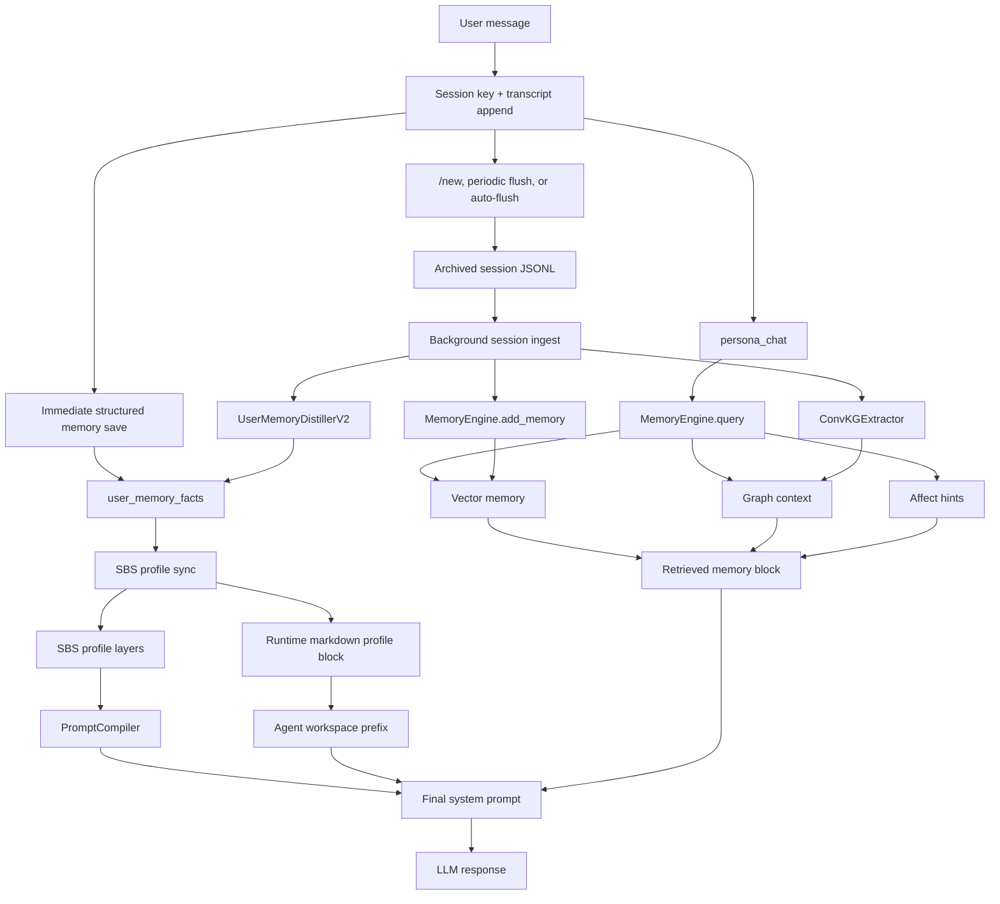

# Synapse Memory Architecture Technical Document

Date: 2026-05-12
Purpose: Source document for an animated AI education video under 3 minutes.
Audience: AI builders, developers, and technical founders who understand chatbots but may not know how long-term AI memory is actually engineered.

## 1. Core Thesis

Synapse does not treat memory as "just a longer chat history." Its memory architecture is a layered system that turns conversation into durable context, emotional continuity, user profile adaptation, retrieval-ready documents, and graph relationships.

The simplest explanation:

1. The current turn is saved immediately so identity, preferences, people, projects, routines, and corrections are not lost.
2. The active chat session is stored as a transcript while the conversation continues.
3. When the session ends, idles, or grows large, Synapse archives it and runs a deeper memory loop in the background.
4. That background loop stores the session in vector memory, extracts structured facts, extracts graph triples, and syncs stable user facts into the SBS profile.
5. Future replies are generated from a composed prompt that includes static identity rules, the dynamic SBS persona, retrieved memories, graph context, affect hints, and recent chat history.

This gives Synapse two kinds of continuity:

- Factual continuity: "What does the user like, do, build, mention, or correct?"
- Behavioral continuity: "How should Synapse sound, prioritize, comfort, challenge, or adapt to this user?"

## 2. Video-Friendly Mental Model

Think of Synapse memory as a four-layer brain:

1. Short-term workspace
   - The active transcript and in-memory conversation cache.
   - Used to keep the current conversation coherent.

2. Long-term searchable memory
   - Session chunks stored in `memory.db`, sqlite-vec, and LanceDB.
   - Used for semantic recall across old conversations.

3. Structured user profile
   - Deterministic and LLM-assisted distilled facts in `user_memory_facts`.
   - Synced into SBS profile layers and runtime markdown identity files.

4. Relationship and meaning graph
   - Entity triples stored in `entity_links` and the graph store.
   - Used to connect people, projects, preferences, places, and facts.

The important design idea is separation of responsibility. Raw chat, retrievable memories, durable user facts, emotional tags, and prompt personality are not mashed into one blob. Each has a different storage model and runtime role.

## 3. High-Level Architecture



## 4. Runtime Turn Flow

The live path begins in the gateway pipeline.

Relevant files:

- `workspace/sci_fi_dashboard/pipeline_helpers.py`
- `workspace/sci_fi_dashboard/chat_pipeline.py`
- `workspace/sci_fi_dashboard/user_memory.py`
- `workspace/sci_fi_dashboard/sbs/orchestrator.py`

Step by step:

1. Resolve the target persona and channel session.
   - Synapse builds a canonical `session_key` from agent id, channel, peer id, peer kind, account id, DM scope, and identity links.
   - This keeps Telegram, WhatsApp, Discord, Slack, CLI, groups, and direct messages separated correctly.

2. Append the user message to the transcript.
   - The user turn is written before the LLM call.
   - Synapse creates an action receipt proving the message was captured.

3. Save lightweight structured facts immediately.
   - `_sync_user_turn_memory()` runs deterministic extraction against the current user message.
   - It stores identity, people, projects, preferences, routines, correction rules, and commitments into `user_memory_facts`.
   - If facts are found, it calls `sbs.sync_user_memory()` so the SBS profile can update during long-running chats, not only after `/new`.

4. Retrieve older memory.
   - `persona_chat()` calls `deps.memory_engine.query(...)`.
   - Retrieval can include semantic vector results, graph context, and affect hints.

5. Compile the prompt.
   - Static agent workspace files are loaded first.
   - SBS dynamic persona is compiled and injected.
   - Retrieved memories are added in a guarded block.
   - Recent chat history and tool context are added according to prompt tier.

6. Generate and save the assistant reply.
   - The assistant response is appended to the transcript.
   - Background save, compaction, and periodic memory flush may be scheduled.

## 5. Immediate Structured User Memory

File: `workspace/sci_fi_dashboard/user_memory.py`

The immediate memory path is deterministic. This matters because it can run on every turn without waiting on a cloud model.

The main table is `user_memory_facts`.

Key columns:

- `user_id`: the session/person identity.
- `kind`: category such as `identity`, `preference`, `routine`, `relationship`, `project`, or `correction`.
- `key`: stable dedupe key.
- `value`: machine-readable value.
- `summary`: prompt-ready human-readable fact.
- `confidence`: reliability score.
- `source_doc_id`: optional link back to a stored session document.
- `evidence`: source snippet or summary.
- `status`: usually `active`.
- affect fields: sentiment, mood, emotional intensity, tension type, user need, response style hint, emotion tags, affect topics.

Important behavior:

- Facts are upserted by `(user_id, kind, key)`.
- Seeing a newer value updates the existing fact instead of duplicating it.
- `last_seen` is refreshed, which lets sync logic prefer newer facts.
- Affect tags are extracted alongside facts so emotional context travels with memory.

Examples of deterministic extraction:

- "keep it short" -> `preference/response_style = direct`
- "call me Blue Lantern" -> `identity/codename = Blue Lantern`
- "Ava is my designer" -> `relationship/person_ava`
- "Synapse is my current project" -> `project/project_synapse`
- "do not call me X" -> `correction/avoid_calling_me_x`
- "remind me to ship the demo" -> `routine/commitment_...`

This is the fast memory lane: cheap, stable, and available immediately.

## 6. User Memory Distiller V2

File: `workspace/sci_fi_dashboard/user_memory_distiller_v2.py`

The V2 distiller adds a durable middle layer between raw transcript chunks and confirmed facts:

```text
observation -> candidate facts -> confirmed facts -> profile updates
```

Tables:

- `user_memory_observations`
  - Raw transcript chunks waiting for memory extraction.

- `user_memory_candidate_facts`
  - Possible facts proposed by an extractor.

- `user_memory_profile_updates`
  - Proposed direct updates to profile layers.

- `user_memory_facts`
  - Confirmed facts that become durable memory.

Extractor strategy:

- If an async LLM extractor is available, Synapse asks it for strict JSON.
- The expected JSON keys are `observations`, `candidate_facts`, `confirmed_facts`, and `profile_updates`.
- If the extractor fails, times out, or returns invalid JSON, deterministic V1 extraction is used as fallback.

This gives Synapse a production-safe pattern:

- LLM extraction can add nuance.
- Deterministic extraction keeps the memory system alive when the LLM path fails.
- Invalid extractor output does not destroy the pipeline.

## 7. Session Archive and Background Ingest

Relevant files:

- `workspace/sci_fi_dashboard/pipeline_helpers.py`
- `workspace/sci_fi_dashboard/session_ingest.py`
- `workspace/sci_fi_dashboard/auto_flush.py`

Synapse does not push the full memory loop into the foreground chat path. The user should get a response quickly, while deeper memory work runs in the background.

There are three main triggers:

1. Manual `/new`
   - Archives the current transcript.
   - Clears conversation cache.
   - Rotates the session.
   - Starts background ingest.

2. Periodic memory flush
   - Snapshots only the new transcript tail.
   - Avoids duplicating the whole conversation.
   - Runs when enough messages accumulate or enough time passes.

3. Auto-flush scanner
   - Flushes sessions that are idle or too long.
   - Defaults are built around 6 hours idle and 50 messages.
   - This matches the SBS batch threshold so memory ingest and profile learning stay aligned.

The background ingest loop performs three jobs per batch:

1. Vector ingest
   - `MemoryEngine.add_memory(content=text, category="session", hemisphere=...)`
   - Stores the formatted transcript batch as a document.
   - Writes embedding metadata and affect overlay.

2. Structured user fact distillation
   - `distill_and_upsert_user_memory_facts_v2(...)`
   - Creates or updates durable `user_memory_facts`.

3. Knowledge graph extraction
   - `ConvKGExtractor.extract(text)` produces validated triples.
   - Triples are written to both the in-memory graph and `entity_links`.
   - The document is marked as KG processed.

The key architecture choice: background ingest is fire-and-forget, but it logs failures into `ingest_failures`. Chat stays responsive while memory remains observable.

## 8. Long-Term Vector Memory

File: `workspace/sci_fi_dashboard/memory_engine.py`

`MemoryEngine` owns the long-term searchable memory path.

Write path:

1. Create a backup log entry.
2. Insert a row into `documents`.
3. Score importance with a fast heuristic.
4. Extract affect tags and upsert `memory_affect`.
5. Generate an embedding.
6. Insert into sqlite-vec `vec_items`.
7. Upsert into LanceDB.
8. Mark the document as processed.

Storage surfaces:

- `documents`: raw memory chunks.
- `vec_items`: sqlite-vec embeddings.
- LanceDB: ANN/vector search store.
- `memory_affect`: emotional metadata overlay.
- backup JSONL: best-effort persistence copy.

Failure policy:

- Backup log failure is non-fatal.
- Affect failure is non-fatal.
- LanceDB failure is non-fatal.
- Embedding failure queues the document for later processing.

This is robust engineering: memory storage should degrade gracefully instead of making chat fail.

## 9. Affect-Aware Memory

File: `workspace/sci_fi_dashboard/memory_affect.py`

Synapse stores not just what happened, but also the emotional shape around it.

The affect overlay tracks:

- `sentiment`: positive, negative, mixed, neutral.
- `mood`: angry, sad, loving, anxious, frustrated, excited, focused, tired, etc.
- `emotional_intensity`: 0.0 to 1.0.
- `tension_type`: neglect, rejection, insecurity, conflict, pressure, boundary, growth, safety, etc.
- `user_need`: validation, reassurance, clarity, comfort, grounding, accountability, encouragement, etc.
- `response_style_hint`: warm, soft, grounding, firm, direct, playful, protective, celebratory.
- topics and confidence.

At query time:

1. Synapse extracts affect from the current user message.
2. It loads affect tags for candidate memories.
3. It computes an affect match score.
4. It blends affect into the final memory ranking.

Current combined scoring in `MemoryEngine.query()`:

```text
semantic relevance * 0.35
+ temporal freshness * 0.20
+ importance * 0.20
+ affect match * 0.25
```

Guardrail:

- Affect only matters when the current query has meaningful emotional signal.
- Neutral factual questions should not be hijacked by emotional memories.

This is why Synapse can respond differently to:

- "What was that package name?"
- "I feel ignored again."

Both may need memory, but not the same kind of memory.

## 10. Knowledge Graph Memory

Relevant files:

- `workspace/sci_fi_dashboard/conv_kg_extractor.py`
- `workspace/sci_fi_dashboard/db.py`
- `workspace/sci_fi_dashboard/memory_engine.py`

The graph path extracts relationships from conversation:

```text
subject -> relation -> object
```

Examples:

- User -> works_on -> Synapse
- User -> prefers -> concise responses
- Project -> has_deadline -> Friday
- Person -> relation_to_user -> designer

`entity_links` stores:

- `subject`
- `relation`
- `object`
- `archived`
- `confidence`
- `source_doc_id`
- `source_fact_id`

Single-valued relations can archive old values before inserting new ones. Multi-valued relations can append.

At query time, `MemoryEngine.query()` can seed graph lookup with configured self-entity names. This helps first-person queries like "my project" resolve into graph context even when the user does not explicitly name themselves.

The graph gives Synapse connected memory, not just isolated snippets.

## 11. SBS: Soul-Brain Sync

Relevant files:

- `workspace/sci_fi_dashboard/sbs/orchestrator.py`
- `workspace/sci_fi_dashboard/sbs/profile/manager.py`
- `workspace/sci_fi_dashboard/sbs/processing/realtime.py`
- `workspace/sci_fi_dashboard/sbs/processing/batch.py`
- `workspace/sci_fi_dashboard/sbs/injection/compiler.py`
- `workspace/sci_fi_dashboard/sbs/profile/sync.py`

SBS is the behavioral continuity engine.

It is not only a memory store. It is the system that turns interaction history into a living persona profile.

### 11.1 Profile Layers

SBS stores profile state as layered JSON files:

- `core_identity`
  - Assistant identity, relationship, base tone, red lines, personality pillars.
  - Immutable through normal programmatic writes.

- `linguistic`
  - Preferred language, local examples, language mix, message length, emoji frequency, style drift.

- `emotional_state`
  - Current dominant mood, sentiment average, recent mood history.

- `domain`
  - Active domains, stable identity notes, important people, important projects.

- `interaction`
  - Activity patterns, response length, privacy sensitivity, response style, routines, correction rules.

- `vocabulary`
  - Personal/local terms, frequency, temporal decay, top terms.

- `exemplars`
  - Few-shot examples that show how Synapse should reply.

- `meta`
  - Created time, last batch run, total messages processed, version, schema.

### 11.2 Realtime Processor

The realtime processor runs on every SBS message:

- Detects language mix.
- Scores sentiment.
- Detects mood.
- Buffers emotional state updates.
- Flushes emotional changes safely without breaking the chat path.

This is the "hot path" for present-tense mood adaptation.

### 11.3 Batch Processor

The batch processor runs every threshold, time window, startup condition, or manual trigger.

Responsibilities:

- Vocabulary census.
- Linguistic style analysis.
- Interaction pattern analysis.
- Domain map update.
- Exemplar re-selection.
- Temporal decay sweep.
- Version snapshot.

This is the "slow path" for deeper profile evolution.

### 11.4 Profile Versioning and Rollback

`ProfileManager` snapshots the current profile into archived versions.

Important details:

- Layers are protected by file locks.
- `core_identity` is immutable through normal `save_layer()`.
- Rollback restores a prior version but keeps current `core_identity`.
- Old snapshots are pruned by configured max version count.

This makes SBS auditable and recoverable.

## 12. Syncing User Facts Into SBS

File: `workspace/sci_fi_dashboard/sbs/profile/sync.py`

Structured user facts become behavior through sync.

Mappings:

- `preference/response_style` -> `interaction.preferred_response_style`
- routines -> `interaction.stable_routines`
- corrections -> `interaction.correction_rules`
- identity summaries -> `domain.stable_identity_notes`
- relationships -> `domain.important_people`
- projects -> `domain.important_projects`

The same sync also writes managed blocks into runtime markdown files:

- `SOUL.md`
- `CORE.md`
- `IDENTITY.md`
- `USER.md`
- `MEMORY.md`

Only the generated block between these markers is changed:

```text
<!-- SYNAPSE:DYNAMIC_USER_PROFILE:BEGIN -->
...
<!-- SYNAPSE:DYNAMIC_USER_PROFILE:END -->
```

This is a clean boundary:

- Human-authored identity files are preserved.
- Dynamic user profile text can update safely.
- Prompt cache is invalidated when runtime identity files change.

## 13. Prompt Composition

Relevant files:

- `workspace/sci_fi_dashboard/chat_pipeline.py`
- `workspace/sci_fi_dashboard/sbs/injection/compiler.py`
- `workspace/sci_fi_dashboard/prompt_tiers.py`

Prompt assembly has multiple layers:

1. Agent workspace prefix
   - `SOUL`, `CORE`, `IDENTITY`, `USER`, `TOOLS`, `MEMORY`, `AGENTS`.
   - Loaded from user workspace first, then templates, then repo defaults.
   - Anchors stable identity, rules, tool discipline, and runtime instructions.

2. SBS dynamic persona
   - Compiled from profile layers.
   - Adds current mood, learned interaction notes, vocabulary, style, exemplars, and domain context.

3. Retrieved memories
   - Explicitly marked as real retrieved facts.
   - Includes permanent profile, recent memory context, graph context, and affect hints.

4. Runtime info
   - Injects live model/runtime metadata so the assistant does not hallucinate its own identity.

5. History and tool context
   - Included according to prompt-tier policy.

Important guardrail:

The retrieved memory block tells the model to use only facts present in memory and not invent names, events, or details.

## 14. Prompt Tier Policies

File: `workspace/sci_fi_dashboard/prompt_tiers.py`

Synapse can route turns to frontier cloud models, mid-size models, or small local models. Prompt rendering changes by tier.

Prompt tiers:

- `frontier`
  - Target: 19,000 tokens.
  - Memory limit: 5.
  - Graph context: yes.
  - MCP context: yes.
  - History turns: 6.
  - Native tool schemas: yes.

- `mid_open`
  - Target: 12,000 tokens.
  - Memory limit: 3.
  - Graph context: yes.
  - MCP context: yes.
  - History turns: 4.
  - Native tool schemas: yes.

- `small`
  - Target: 8,000 tokens.
  - Memory limit: 1.
  - Minimum memory score: 0.85.
  - Graph context: no.
  - MCP context: no.
  - History turns: 2.
  - Native tool schemas: no.

This prevents the memory architecture from assuming every model can digest the same context load.

## 15. Data Stores Summary

| Store | Type | Role |
|---|---|---|
| Active transcript JSONL | File | Current session record |
| Conversation cache | Memory | Fast current-turn context |
| Archived transcript JSONL | File | Background ingest source |
| `documents` | SQLite | Stored memory chunks |
| `vec_items` | sqlite-vec | Vector search index |
| LanceDB | Vector DB | ANN search over memory |
| `memory_affect` | SQLite | Emotional metadata overlay |
| `user_memory_facts` | SQLite | Durable structured user facts |
| `user_memory_observations` | SQLite | V2 distiller queue |
| `user_memory_candidate_facts` | SQLite | Proposed facts |
| `user_memory_profile_updates` | SQLite | Proposed profile changes |
| `entity_links` | SQLite | Knowledge graph triples |
| SBS profile JSON | Files | Behavioral/persona profile |
| Runtime markdown files | Files | Dynamic prompt identity blocks |
| `ingest_failures` | SQLite | Observability for background ingest |

## 16. Why This Architecture Matters

Most chatbot memory systems do one of these:

- Dump old messages into context.
- Store vector snippets and retrieve top-k.
- Keep a static user profile.

Synapse combines multiple memory representations:

- Transcript memory for source-of-truth history.
- Vector memory for fuzzy recall.
- Structured facts for stable personalization.
- Affect tags for emotional continuity.
- Graph triples for relationship understanding.
- SBS profile layers for behavioral adaptation.
- Prompt tiers for model-aware context budgeting.

That combination is why memory can be both useful and controllable.

## 17. Guardrails and Reliability Patterns

Key production guardrails:

- Immediate memory save happens before the LLM call.
- Memory writes produce action receipts.
- Background ingest never blocks chat.
- LLM distillation has deterministic fallback.
- Affect extraction failure does not fail memory storage.
- Backup log failure does not fail memory storage.
- Vector store failure does not fail the whole write.
- `core_identity` is protected from programmatic mutation.
- Profile layers use file locks.
- Profile versions can be rolled back.
- Session archive/ingest failures are logged.
- Prompt tier policies limit context for smaller models.
- Retrieved memory is injected with anti-hallucination instructions.

## 18. What To Show In The Animated Video

Target length: under 3 minutes.

Recommended pacing:

### 0:00-0:15 - Hook

Visual:

- A chatbot with a huge scrolling chat log.
- The log collapses and breaks.
- Cut to Synapse as a layered memory system.

Narration idea:

"Most people think AI memory means stuffing more chat history into the prompt. Synapse does something different. It turns conversation into a living memory architecture."

### 0:15-0:40 - Four-Layer Brain

Visual:

- Four stacked layers: active transcript, vector memory, structured facts, knowledge graph/SBS profile.

Narration idea:

"Every message goes through multiple memory lanes. Short-term context keeps the current chat coherent. Vector memory makes old conversations searchable. Structured facts capture preferences and identity. SBS turns patterns into personality."

### 0:40-1:15 - Live Turn Flow

Visual:

- User sends message.
- Message is appended to transcript.
- Small facts are extracted instantly.
- The prompt pulls SBS and retrieved memory.
- Model replies.

Narration idea:

"On every turn, Synapse saves the user message first, extracts lightweight facts immediately, retrieves relevant memories, compiles a dynamic persona prompt, and only then asks the model to respond."

### 1:15-1:50 - Background Memory Loop

Visual:

- `/new` or idle timer archives session.
- Background workers split transcript into batches.
- One path goes to vector DB.
- One path goes to facts.
- One path goes to graph triples.

Narration idea:

"The deep memory work happens in the background. When a session ends or grows large, Synapse archives it, embeds it, extracts stable user facts, and builds relationship triples like project, person, preference, and context links."

### 1:50-2:20 - SBS Personality Update

Visual:

- Facts flow into SBS profile layers.
- Emotional state, interaction patterns, vocabulary, exemplars, domain interests update.
- Prompt compiler creates a persona block.

Narration idea:

"SBS is the behavioral layer. It tracks mood, language style, routines, corrections, important people, projects, and examples of good replies. That profile becomes a compact persona block injected into future prompts."

### 2:20-2:45 - Affect-Aware Retrieval

Visual:

- Two user queries: factual and emotional.
- Factual query highlights semantic memory.
- Emotional query highlights affect-matching memories.

Narration idea:

"Synapse also remembers emotional shape. A factual question should retrieve facts. But if the user says they feel ignored again, Synapse can retrieve memories with similar mood, tension, and user need, then respond with the right tone."

### 2:45-3:00 - Close

Visual:

- The architecture loops: message -> memory -> profile -> better response.

Narration idea:

"So the real trick is not bigger context. It is structured continuity: facts, feelings, relationships, and behavior, each stored in the right layer."

## 19. Key Terms For On-Screen Labels

Use these short labels in animation:

- Active transcript
- Immediate facts
- Session archive
- Vector memory
- Affect tags
- Knowledge graph
- SBS profile
- Prompt compiler
- Retrieved memory
- Dynamic persona
- Guardrails

## 20. One-Sentence Summary

Synapse memory is a layered architecture that captures the current chat, archives sessions, stores semantic memories, distills durable user facts, tags emotional context, extracts graph relationships, syncs everything into an evolving SBS profile, and injects only the right context back into future prompts.

## 21. Source Map

Use these repo files when updating or fact-checking the video:

- Turn pipeline: `workspace/sci_fi_dashboard/pipeline_helpers.py`
- Prompt assembly: `workspace/sci_fi_dashboard/chat_pipeline.py`
- Prompt tier policy: `workspace/sci_fi_dashboard/prompt_tiers.py`
- Long-term memory engine: `workspace/sci_fi_dashboard/memory_engine.py`
- Memory retrieval fallback: `workspace/sci_fi_dashboard/retriever.py`
- Affect overlay: `workspace/sci_fi_dashboard/memory_affect.py`
- Structured facts: `workspace/sci_fi_dashboard/user_memory.py`
- Distiller V2: `workspace/sci_fi_dashboard/user_memory_distiller_v2.py`
- Background ingest: `workspace/sci_fi_dashboard/session_ingest.py`
- Auto-flush: `workspace/sci_fi_dashboard/auto_flush.py`
- Database schema: `workspace/sci_fi_dashboard/db.py`
- SBS orchestrator: `workspace/sci_fi_dashboard/sbs/orchestrator.py`
- SBS profile manager: `workspace/sci_fi_dashboard/sbs/profile/manager.py`
- SBS profile sync: `workspace/sci_fi_dashboard/sbs/profile/sync.py`
- SBS realtime processor: `workspace/sci_fi_dashboard/sbs/processing/realtime.py`
- SBS batch processor: `workspace/sci_fi_dashboard/sbs/processing/batch.py`
- SBS prompt compiler: `workspace/sci_fi_dashboard/sbs/injection/compiler.py`
- Session acceptance test: `workspace/tests/test_dynamic_memory_personality_acceptance.py`
