# 🧬 SYNAPSE — Multi-Agent AI Assistant with Hybrid Memory, Evolving Personality, and Privacy-First Routing

> **📢 Renamed from Jarvis-OSS to Synapse-OSS (Feb 2026)** — Same codebase, new name!


> **🚧 Under Active Maintenance** — Features may change, bugs are being fixed. Use at your own risk and check back for updates.

> A self-hosted AI system that remembers everything, develops its own personality
> from conversation patterns, thinks before replying, and routes private conversations
> to local models with zero cloud exposure. Built on top of
> [OpenClaw](https://github.com/openclaw/openclaw). Running 24/7 on a MacBook Air.

> **New here?** Jump to [Quick Start](#-quick-start) or read [HOW_TO_RUN.md](HOW_TO_RUN.md) for full setup instructions.
>
> **Want the story behind the engineering?** Read [MANIFESTO.md](MANIFESTO.md) — the opinionated, in-character deep-dive.

> **Platform Note:** Developed and tested on macOS (Apple Silicon).
> Windows is fully supported — `pip install`, onboarding script, and the web
> browsing tool all work on Windows 11 out of the box. Linux should work but
> is less tested. If you hit issues, please
> [open an issue](https://github.com/UpayanGhosh/Synapse-OSS/issues).

> **⚠️ CRITICAL: WhatsApp-Only Platform(For now)**
> This system is designed exclusively for **WhatsApp** messaging. All features — async message pipeline, persona routing, hybrid memory, The Vault privacy routing, and multi-model MoA — operate through WhatsApp webhooks and the WhatsApp API. Voice notes, media handling, and outbound messaging are all WhatsApp-specific.

---

## 💡 What Makes This Different

Most AI chatbot projects are thin wrappers around an API call.
Synapse is an **11-subsystem architecture** that solves problems
most chatbots ignore:

| Problem                            | How Most Bots Handle It                               | How JARVIS Handles It                                                                                                                                   |
| ---------------------------------- | ----------------------------------------------------- | ------------------------------------------------------------------------------------------------------------------------------------------------------- |
| **Memory**                   | Stuff messages into context window until it overflows | Hybrid RAG — SQLite knowledge graph + Qdrant vector search + FlashRank reranking. Remembers everything, retrieves what's relevant in <350ms.           |
| **Personality**              | Static system prompt, same tone forever               | Soul-Brain Sync — continuously tracks mood, sentiment, language patterns. Rebuilds a behavioral profile every 50 messages. Personality evolves.        |
| **Model selection**          | One model for everything (expensive or dumb)          | Mixture of Agents — Traffic Cop classifies intent, routes to 5 specialist models. Casual chat doesn't burn expensive API credits.                      |
| **Privacy**                  | Everything goes to cloud APIs                         | The Vault — sensitive conversations route to a local Ollama model on LAN. Zero cloud leakage. Zero external logging.                                   |
| **Thinking**                 | Generate first token immediately                      | Dual Cognition — generates inner monologue, calculates tension between memory and current message, then responds.                                      |
| **WhatsApp reliability**     | Webhook timeout, lost messages, duplicates            | Async pipeline — FloodGate batching, deduplication, bounded queue, concurrent workers. Zero dropped messages.                                          |
| **RAM on consumer hardware** | "Just buy a bigger server"                            | Lazy-loading (ToxicScorer unloads after 30s idle), SQLite instead of NetworkX (99.2% memory reduction), thermal-aware workers. Runs on 8GB MacBook Air. |
| **Voice Notes**            | Ignore or crash                                       | Groq Whisper — 2-4s cloud transcription, zero local RAM, then processed like text through the full cognitive pipeline.                                       |

---

## 📸 Demo

### WhatsApp Conversation

> *Synapse responding to a real message with memory context, persona adaptation, and model routing visible in the footer stats.*

### Architecture Overview



---

## 📊 By The Numbers

> `99.2% memory reduction` · `<350ms P95 retrieval` · `6 models orchestrated` · `Zero dropped messages` · `24/7 uptime on $999 hardware` · `92 Python modules`

| Metric                    | Before (v1.0)                  |  After (Phoenix v3)  | Why it changed                                                                                                                                               |
| ------------------------- | ------------------------------ | :-------------------: | ------------------------------------------------------------------------------------------------------------------------------------------------------------ |
| Memory Footprint          | ~155MB in-RAM graph (NetworkX) |   **<1.2MB**   | NetworkX required loading the entire graph into RAM, causing 81% memory pressure on an 8GB host. SQLite reads from disk on demand.**99.2% reduction.** |
| Host RAM Usage            | 81.3%                          |    **<25%**    | Eliminated Qdrant container + NetworkX + separate memory server process into a single FastAPI app.**3.3× lower.**                                     |
| Retrieval Latency (P95)   | ~1.2s                          |   **<350ms**   | High-confidence results (>0.80) bypass the reranker entirely — only ambiguous queries pay the FlashRank overhead.**3.4× faster.**                    |
| Vocabulary Diversity      | ~5,000 static terms            |   **37,868+**   | Continuous ingestion from 4 years of conversation logs via the SBS batch pipeline.**7.6× richer.**                                                    |
| Message Pipeline          | Synchronous                    | **Async Queue** | Webhook returns `202 Accepted` immediately; processing happens in background workers. **Zero dropped messages** (single-user load).                  |
| Cognitive Overhead (TTFT) | N/A                            |    **2-5s**    | Dual Cognition pipeline adds 2-5s Time-To-First-Token for enhanced reasoning quality.**Quality-for-speed trade-off.**                                  |

---

## 🏗️ System Architecture

> *For the full interactive diagram with Mermaid breakdowns of each subsystem, see [ARCHITECTURE.md](ARCHITECTURE.md).*

The system consists of 11 interconnected subsystems:

```
┌─────────────────────────────────────────────────────────────────┐
│                        WhatsApp Webhook                         │
└──────────────────────────┬──────────────────────────────────────┘
                           │
                           ▼
┌─────────────────────────────────────────────────────────────────┐
│                      Async Gateway Pipeline                     │
│  ┌─────────┐  ┌─────────┐  ┌─────────┐  ┌──────────────┐    │
│  │FloodGate│→│ Dedup   │→│  Queue   │→│ MessageWorker │    │
│  └─────────┘  └─────────┘  └─────────┘  └──────────────┘    │
└──────────────────────────┬──────────────────────────────────────┘
                           │
                           ▼
┌─────────────────────────────────────────────────────────────────┐
│                      Cognitive Pipeline                          │
│  ┌──────────┐  ┌──────────┐  ┌───────────┐  ┌───────────┐   │
│  │ Memory   │→│   SBS    │→│DualCognition│→│ TrafficCop│   │
│  └──────────┘  └──────────┘  └───────────┘  └───────────┘   │
└──────────────────────────┬──────────────────────────────────────┘
                           │
                           ▼
┌─────────────────────────────────────────────────────────────────┐
│                    Multi-Model Router                            │
│  ┌────────┐ ┌────────┐ ┌────────┐ ┌────────┐ ┌──────────┐   │
│  │ Gemini │ │ Claude │ │ Ollama │ │  Vault │ │ Fallback │   │
│  └────────┘ └────────┘ └────────┘ └────────┘ └──────────┘   │
└─────────────────────────────────────────────────────────────────┘
```

---

## 🚀 Quick Start

```bash
# 1. Clone
git clone https://github.com/UpayanGhosh/Synapse-OSS.git
cd Synapse-OSS

# 2. Environment
# macOS/Linux:
python3 -m venv .venv && source .venv/bin/activate

# Windows:
python -m venv .venv
.venv\Scripts\activate.bat

pip install -r requirements.txt

# macOS/Linux only — downloads browser for web browsing feature:
crawl4ai-setup
# Windows: Playwright (the Windows browser backend) is installed automatically
#          by synapse_onboard.bat — no manual step needed here.

# 3. Configure
# macOS/Linux:
cp .env.example .env

# Windows:
copy .env.example .env

# Edit .env — only GEMINI_API_KEY is required to start.
# GROQ_API_KEY enables voice transcription (optional).

# 4. Boot the Gateway
# macOS/Linux:
cd workspace
uvicorn sci_fi_dashboard.api_gateway:app --host 0.0.0.0 --port 8000

# Windows:
cd workspace
python -m uvicorn sci_fi_dashboard.api_gateway:app --host 0.0.0.0 --port 8000

# Gateway starts on http://localhost:8000

# 5. Verify
curl http://localhost:8000/health
# Windows: curl.exe http://localhost:8000/health
```

### Docker Quick Start

```bash
git clone https://github.com/UpayanGhosh/Synapse-OSS.git
cd Synapse-OSS
cp .env.example .env    # Edit .env with your API keys (Windows: copy .env.example .env)

docker compose up --build
# Gateway: http://localhost:8000  |  Qdrant: http://localhost:6333
```

---

## 💻 Usage Examples

### Chat with Synapse

```bash
# macOS/Linux
curl -X POST http://localhost:8000/chat/the_creator \
  -H "Content-Type: application/json" \
  -d '{"message": "What do you remember about our last conversation?"}'

# Windows
curl.exe -X POST http://localhost:8000/chat/the_creator -H "Content-Type: application/json" -d "{\"message\": \"What do you remember about our last conversation?\"}"
```

### Query Memory

```bash
# macOS/Linux
curl -X POST http://localhost:8000/query \
  -H "Content-Type: application/json" \
  -d '{"text": "What is the user'\''s favorite programming language?"}'

# Windows
curl.exe -X POST http://localhost:8000/query -H "Content-Type: application/json" -d "{\"text\": \"What is the user's favorite programming language?\"}"
```

### Add Memory

```bash
# macOS/Linux
curl -X POST http://localhost:8000/add \
  -H "Content-Type: application/json" \
  -d '{"content": "The user prefers Python over JavaScript", "category": "tech_preferences"}'

# Windows
curl.exe -X POST http://localhost:8000/add -H "Content-Type: application/json" -d "{\"content\": \"The user prefers Python over JavaScript\", \"category\": \"tech_preferences\"}"
```

### Check System Health

```bash
curl http://localhost:8000/health
# Windows: curl.exe http://localhost:8000/health
```

### Rebuild Persona Profile

```bash
# macOS/Linux
curl -X POST http://localhost:8000/persona/rebuild

# Windows
curl.exe -X POST http://localhost:8000/persona/rebuild
```

> **Full setup guide** (Qdrant, Ollama, WhatsApp bridge, persona config): [HOW_TO_RUN.md](HOW_TO_RUN.md)
>
> **Persona customization** (how to make Synapse yours): [SETUP_PERSONA.md](SETUP_PERSONA.md)

---

## ⚙️ Key Features

### Async Gateway Pipeline (Message Queue + Workers)

Messages enter through a multi-stage async pipeline (`gateway/`) that prevents webhook timeouts. A `FloodGate` (batch aggregator, 3s window) merges rapid-fire messages, a `MessageDeduplicator` (seen-set filter, 5-min window) absorbs retry storms, and a bounded `TaskQueue` (asyncio FIFO, max 100) feeds two concurrent `MessageWorker` instances. The webhook returns `202 Accepted` immediately — the cognitive pipeline processes in the background. **Zero dropped messages** under single-user load (~50-100 messages/day).

### Multi-Model Intent Router (Mixture of Agents Pattern)

A lightweight intent classifier (zero-shot Gemini Flash call) routes each message to the best-fit model: Gemini Flash for casual chat, Claude Sonnet for code generation, Gemini Pro for deep analysis, Claude Opus for critical review, or a local Ollama instance for private conversations. All models are accessed through a unified OpenAI-compatible proxy, making the system completely vendor-agnostic. A `CREDIT_SAVER` fallback gracefully downgrades to cheaper models when provider credits are exhausted.

### Hybrid Memory Retrieval (RAG)

The `MemoryEngine` combines a SQLite-backed knowledge graph (subject–predicate–object triples) with Qdrant vector search (`nomic-embed-text` embeddings). A temporal scoring function blends semantic similarity with recency. High-confidence results (>0.80) skip the reranker for speed; lower-confidence candidates pass through FlashRank (ms-marco-TinyBERT) for precision. Result: **<350ms P95 retrieval** across 37,000+ vocabulary terms.

### Soul-Brain Sync (Continuous Batch Profiling Pipeline)

Rather than static system prompts, the SBS pipeline continuously builds and evolves a 2KB behavioral profile per conversation target. A `RealtimeProcessor` (rule-based sentiment + language detection) captures mood signals on every message. A `BatchProcessor` runs periodically (every 50 messages or 6 hours) to distill conversation patterns into structured JSON layers (emotional state, linguistic style, vocabulary). The `PromptCompiler` injects this profile into the system prompt at inference time. **Why not fine-tuning?** Profile injection is model-agnostic and costs zero training compute — the persona adapts regardless of which LLM is active.

### Dual Cognition Engine (Pre-Response Reasoning Layer)

Before generating a reply, a `DualCognitionEngine` produces an inner monologue (chain-of-thought via Gemini Flash) and calculates a tension score (0.0–1.0) to detect emotional conflicts between retrieved memory and the current message. This cognitive context is injected into the prompt alongside memories and persona. The `LazyToxicScorer` (Toxic-BERT) loads on demand and auto-unloads after 30s of idle to conserve RAM — on an 8GB machine, every MB matters.

### Air-Gapped Local Inference ("The Vault")

Sensitive conversations route to a local Ollama instance on a dedicated compute node (RTX 3060Ti). Zero cloud API calls, zero external logging. Hemisphere integrity (the separation between cloud-routed and local-only memories) is verified by automated tests (`verify` CLI command).

### Voice Message Transcription (Groq Whisper)

Voice notes received via WhatsApp are transcribed using the Groq API (Whisper-Large-v3). Cloud-based transcription with zero local RAM impact — results in 2-4 seconds. Requires a `GROQ_API_KEY` (free tier available at [console.groq.com](https://console.groq.com)).

### Web Browsing (Platform-Aware)

Synapse can browse the live internet using a headless browser. When the user asks a question requiring real-time data (weather, news, live scores), the `ToolRegistry` dispatches a browser session, extracts clean text, and feeds the result back to the LLM. Content is truncated to 3000 characters to protect context window limits. The backend is platform-aware: **Crawl4AI** on Mac/Linux, **Playwright** on Windows — the `search_web(url)` interface is identical on both.

### Implicit Feedback Detection (SBS Feedback Loop)

The SBS subsystem includes an `ImplicitFeedbackDetector` that watches for conversational corrections. If you tell Synapse "too long" or "be more casual", it automatically adjusts its persona profile (Banglish ratio, response length, formality) — no explicit configuration needed. Corrections take effect immediately; the batch processor reinforces them over time.

### Sentinel File Governance

A fail-closed file governance system (`sbs/sentinel/`) that controls what the AI agent can read, write, or delete. Files are classified as CRITICAL (total lockout), PROTECTED (read-only), MONITORED (read-write with audit logging), or OPEN. All access decisions are logged to an immutable JSONL audit trail.

### Thermal-Aware Background Maintenance (GentleWorker)

A background worker that prunes stale knowledge graph triples and optimizes databases — but only when the host machine is plugged in and CPU usage is below 20%. Designed for consumer hardware where every watt matters.

---

## 🎯 Engineering Competencies Demonstrated

| **Competency**                   | **Evidence in This Repo**                                                                                                                                                                                                 |
| :------------------------------------- | :------------------------------------------------------------------------------------------------------------------------------------------------------------------------------------------------------------------------------ |
| **System Design & Architecture** | Consolidated a 4-process architecture into a single FastAPI process, reducing memory from 155MB to <1.2MB (**99.2% reduction**). Motivated by 81% RAM pressure on an 8GB host — NetworkX loaded the full graph into RAM. |
| **Async Systems**                | Built an async queue-push message gateway with deduplication, flood batching, and concurrent workers — achieving**zero dropped messages** under single-user load (~50-100 msgs/day)                                      |
| **Database Engineering**         | Designing a migration path from Qdrant to a native `sqlite-vec` implementation to eliminate container dependencies and further reduce RAM footprint (Currently supporting parallel retrieval paths).                          |
| **ML Pipeline Orchestration**    | Implemented a multi-model intent router (Mixture of Agents pattern) that classifies messages and dispatches to 6 models (Gemini, Claude, Ollama) through a unified OpenAI-compatible proxy                                      |
| **Performance Optimization**     | Engineered lazy-loading patterns (Toxic-BERT loads on demand, unloads after 30s idle),`keep_alive: 0` model eviction, and thermal-aware background workers — all to run on a MacBook Air with 8GB RAM                        |
| **Privacy Engineering**          | Designed air-gapped local inference routing with hemisphere-enforced memory separation, verified by automated integrity tests                                                                                                   |
| **DevOps & Reliability**         | Built a `launchd`-managed boot sequence with idempotent service control, auto-restart, 12-hour backup rotation, and a real-time observability dashboard                                                                       |
| **Continuous Batch Profiling**   | Built "Soul-Brain Sync" (SBS) — an autonomous ingestion → parsing → distillation pipeline that converts raw conversation logs into a 2KB behavioral profile, injected into the system prompt at inference time               |

---

## 🛠️ Technical Stack

| **Category** | **Technologies**                                                                                               |
| :----------------- | :------------------------------------------------------------------------------------------------------------------- |
| Languages          | Python 3.11, JavaScript (Node.js), Bash                                                                              |
| Frameworks         | FastAPI, Uvicorn, OpenAI SDK                                                                                         |
| Databases          | SQLite (WAL Mode),`sqlite-vec`, Qdrant (Active)                                                                    |
| AI/ML              | Ollama, Google Gemini, Anthropic Claude, OpenRouter, Groq (Whisper), Crawl4AI, Toxic-BERT, FlashRank, sentence-transformers |
| Infrastructure     | macOS `launchd`, OrbStack/Docker, distributed compute (remote GPU node)                                            |
| Practices          | Async programming, queue-based architectures, model-agnostic routing, automated testing, auto-commit version control |

---

## 🏢 Functional Scope

> *This is a single-user, single-node system — not a distributed platform. But it covers a broad surface area of concerns typically split across multiple tools and teams:*
>
> **Async message processing** · **Multi-model intent routing** · **Hybrid knowledge retrieval** (vector + graph) · **Real-time log monitoring** · **Continuous behavioral profiling** · **Service lifecycle management**
>
> *Built and maintained by a single engineer on consumer hardware.*

---

## 📁 Repository Layout

```
workspace/
├── sci_fi_dashboard/              # Core application
│   ├── api_gateway.py             #   Central FastAPI gateway (1,188 lines)
│   ├── memory_engine.py           #   Hybrid RAG engine (Phoenix v3)
│   ├── sqlite_graph.py            #   SQLite knowledge graph
│   ├── dual_cognition.py          #   Inner monologue + tension engine
│   ├── toxic_scorer_lazy.py       #   Lazy-loaded Toxic-BERT scorer
│   ├── retriever.py               #   Qdrant + reranker utilities
│   ├── conflict_resolver.py       #   Conflict detection & dedup
│   ├── smart_entity.py            #   FlashText entity extraction
│   ├── chat_parser.py             #   WhatsApp chat log parser
│   ├── gateway/                   #   Async message pipeline
│   │   ├── queue.py               #     Bounded async task queue
│   │   ├── worker.py              #     Concurrent message workers
│   │   ├── sender.py              #     WhatsApp outbound via CLI
│   │   ├── dedup.py               #     Message deduplication
│   │   └── flood.py               #     Batch window aggregator
│   └── sbs/                       #   Soul-Brain Sync persona engine
│       ├── orchestrator.py        #     SBS lifecycle manager
│       ├── ingestion/             #     Raw log → JSONL pipeline
│       ├── processing/            #     Realtime + batch analysis
│       ├── injection/             #     Profile → system prompt
│       ├── profile/               #     Behavioral profile store
│       ├── feedback/              #     Implicit feedback detection
│       └── sentinel/              #     File governance guardrails
├── db/                           # Database tools & ingestion
│   ├── tools.py                  #   Platform-aware browser (Crawl4AI/Playwright)
│   ├── model_orchestrator.py     #   3-tier local model routing
│   ├── audio_processor.py        #   Groq Whisper transcription
│   └── ingest.py                 #   Bulk file ingestion pipeline
├── scripts/                       # Maintenance & utilities
│   ├── revive_jarvis.sh           #   Full system resurrection
│   ├── ram_watchdog.py            #   Memory pressure monitor
│   ├── latency_watcher.py         #   Response time tracker
│   ├── nightly_ingest.py          #   Scheduled memory digestion
│   ├── fact_extractor.py          #   LLM → knowledge triple extraction
│   └── transcribe_v2.py           #   Voice note → text (Whisper)
├── monitor.py                     # Real-time observability dashboard
├── main.py                        # CLI interface (chat, verify, ingest, vacuum)
└── change_tracker.py              # Auto git commit tracker
```

---

## 🔌 API Reference

| Method   | Route                     | Description                              |
| -------- | ------------------------- | ---------------------------------------- |
| `POST` | `/chat/the_creator`     | Chat as primary user persona             |
| `POST` | `/chat/the_partner`     | Chat as partner persona                  |
| `POST` | `/chat`                 | Generic fallback chat                    |
| `POST` | `/whatsapp/enqueue`     | Async WhatsApp message ingress           |
| `GET`  | `/whatsapp/status/{id}` | Poll status of enqueued message          |
| `POST` | `/persona/rebuild`      | Rebuild persona profiles from logs       |
| `GET`  | `/persona/status`       | Profile statistics                       |
| `POST` | `/ingest`               | Ingest structured fact into graph        |
| `POST` | `/add`                  | Unstructured memory → triple extraction |
| `POST` | `/query`                | Query the knowledge graph                |
| `GET`  | `/health`               | System health check                      |
| `GET`  | `/v1/models`            | OpenAI-compatible model list             |
| `POST` | `/v1/chat/completions`  | OpenAI-compatible chat proxy             |

---

## 📐 Engineering Philosophy

- **Architectural Decision-Making:** Every major subsystem was redesigned at least once based on production feedback — not theoretical planning.
- **Constraint-Driven Engineering:** The entire system was optimized to run on a $999 laptop with 8GB RAM. Every design choice was made under real resource pressure.
- **Production Mindset:** This isn't a demo. It processes real messages, from real users, every day. Uptime, latency, and reliability are measured, not aspirational.
- **End-to-End Ownership:** One engineer. Full stack. From SQLite schema design to async Python workers to shell-script orchestration to real-time monitoring dashboards.

---

## 👨‍💻 Built By

**Upayan Ghosh** — Fresher software engineer building AI systems on evenings and weekends.

This project was built using AI coding tools (Claude, ChatGPT, Gemini, etc.)
for implementation, with architecture design, system integration,
and debugging done by hand. I believe in using every tool available
to build things that work.

- GitHub: [@UpayanGhosh](https://github.com/UpayanGhosh)
- LinkedIn: [https://linkedin.com/in/upayan](https://linkedin.com/in/upayan)
- Email: [upayan1231@gmail.com](mailto:upayan1231@gmail.com)

**Currently open to:** Freelance AI/chatbot projects,
interesting collaborations, and conversations about RAG systems.

---

## 🙏 Attribution

> This entire project was built on the foundation of **[OpenClaw](https://github.com/openclaw/openclaw)**. OpenClaw provides the terminal instrumentation, browser automation, and multi-agent coordination system that made this "brain" possible. Deep respect and gratitude to the creators and maintainers of OpenClaw.

---

## 📚 Documentation

| Document                              | Description                                    |
| ------------------------------------- | ---------------------------------------------- |
| [ARCHITECTURE.md](ARCHITECTURE.md)       | Full system architecture with Mermaid diagrams |
| [HOW_TO_RUN.md](HOW_TO_RUN.md)           | Complete setup and deployment guide            |
| [SETUP_PERSONA.md](SETUP_PERSONA.md)     | Persona customization guide                    |
| [MANIFESTO.md](MANIFESTO.md)             | The in-character design philosophy deep-dive   |
| [CONTRIBUTING.md](CONTRIBUTING.md)       | Contribution guidelines                        |
| [CODE_OF_CONDUCT.md](CODE_OF_CONDUCT.md) | Community code of conduct                      |
