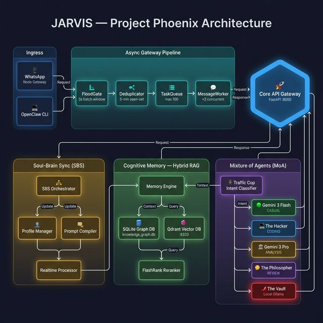
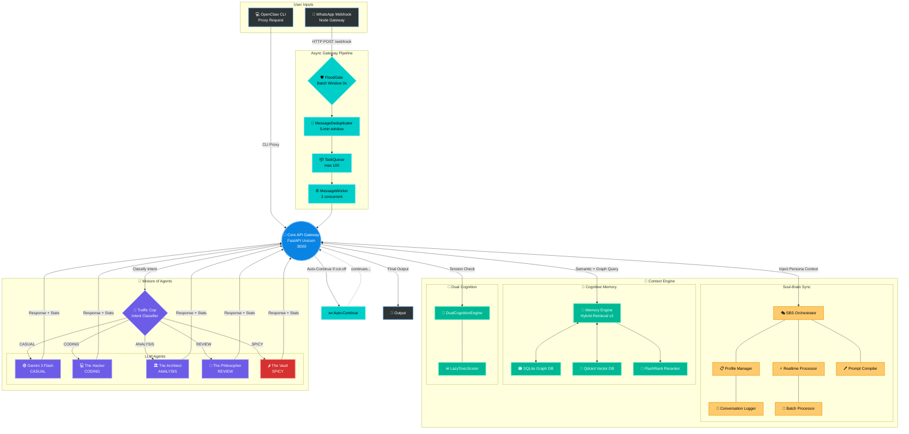

---
# 🧬 JARVIS — Self-Hosted AI Assistant
---


A self-hosted, model-agnostic AI assistant with hybrid memory retrieval, multi-model routing, and an autonomous persona-evolution pipeline — running 24/7 on consumer hardware as a single-user system.

> **New here?** Jump to [Quick Start](#-quick-start) or read [HOW_TO_RUN.md](HOW_TO_RUN.md) for full setup instructions.
>
> **Want the story behind the engineering?** Read [MANIFESTO.md](MANIFESTO.md) — the opinionated, in-character deep-dive.

---

## 📊 By The Numbers

> `15,000+ lines` · `99.2% memory reduction` · `<350ms P95 retrieval` · `6 models orchestrated` · `Zero dropped messages` · `24/7 uptime on $999 hardware` · `92 Python modules`

| Metric | Before (v1.0) | After (Phoenix v3) | Why it changed |
|---|---|:---:|---|
| Memory Footprint | ~155MB in-RAM graph (NetworkX) | **<1.2MB** | NetworkX required loading the entire graph into RAM, causing 81% memory pressure on an 8GB host. SQLite reads from disk on demand. **99.2% reduction.** |
| Host RAM Usage | 81.3% | **<25%** | Eliminated Qdrant container + NetworkX + separate memory server process into a single FastAPI app. **3.3× lower.** |
| Retrieval Latency (P95) | ~1.2s | **<350ms** | High-confidence results (>0.80) bypass the reranker entirely — only ambiguous queries pay the FlashRank overhead. **3.4× faster.** |
| Vocabulary Diversity | ~5,000 static terms | **37,868+** | Continuous ingestion from 4 years of conversation logs via the SBS batch pipeline. **7.6× richer.** |
| Message Pipeline | Synchronous | **Async Queue** | Webhook returns `202 Accepted` immediately; processing happens in background workers. **Zero dropped messages** (single-user load). |
| Cognitive Overhead (TTFT) | N/A | **2-5s** | Dual Cognition pipeline adds 2-5s Time-To-First-Token for enhanced reasoning quality. **Quality-for-speed trade-off.** |

---

## 🏗️ System Architecture



> *For the full interactive diagram with Mermaid breakdowns of each subsystem, see [ARCHITECTURE.md](ARCHITECTURE.md).*



---

## 🎯 Engineering Competencies Demonstrated

| **Competency**                   | **Evidence in This Repo**                                                                                                                                                                                      |
| :------------------------------------- | :------------------------------------------------------------------------------------------------------------------------------------------------------------------------------------------------------------------- |
| **System Design & Architecture** | Consolidated a 4-process architecture into a single FastAPI process, reducing memory from 155MB to <1.2MB (**99.2% reduction**). Motivated by 81% RAM pressure on an 8GB host — NetworkX loaded the full graph into RAM. |
| **Async Systems**                | Built an async queue-push message gateway with deduplication, flood batching, and concurrent workers — achieving **zero dropped messages** under single-user load (~50-100 msgs/day)                            |
| **Database Engineering**         | Designing a migration path from Qdrant to a native `sqlite-vec` implementation to eliminate container dependencies and further reduce RAM footprint (Currently supporting parallel retrieval paths).                 |
| **ML Pipeline Orchestration**    | Implemented a multi-model intent router (Mixture of Agents pattern) that classifies messages and dispatches to 6 models (Gemini, Claude, Ollama) through a unified OpenAI-compatible proxy                       |
| **Performance Optimization**     | Engineered lazy-loading patterns (Toxic-BERT loads on demand, unloads after 30s idle), `keep_alive: 0` model eviction, and thermal-aware background workers — all to run on a MacBook Air with 8GB RAM              |
| **Privacy Engineering**          | Designed air-gapped local inference routing with hemisphere-enforced memory separation, verified by automated integrity tests                                                                                        |
| **DevOps & Reliability**         | Built a `launchd`-managed boot sequence with idempotent service control, auto-restart, 12-hour backup rotation, and a real-time observability dashboard                                                            |
| **Continuous Batch Profiling**   | Built "Soul-Brain Sync" (SBS) — an autonomous ingestion → parsing → distillation pipeline that converts raw conversation logs into a 2KB behavioral profile, injected into the system prompt at inference time    |

---

## 🛠️ Technical Stack

| **Category** | **Technologies**                                                                                               |
| :----------------- | :------------------------------------------------------------------------------------------------------------------- |
| Languages          | Python 3.11, JavaScript (Node.js), Bash                                                                              |
| Frameworks         | FastAPI, Uvicorn, OpenAI SDK                                                                                         |
| Databases          | SQLite (WAL Mode), `sqlite-vec`, Qdrant (Active)                                                                     |
| AI/ML              | Ollama, Google Gemini, Anthropic Claude, OpenRouter, Toxic-BERT, FlashRank, sentence-transformers, Whisper           |
| Infrastructure     | macOS `launchd`, OrbStack/Docker, distributed compute (remote GPU node)                                              |
| Practices          | Async programming, queue-based architectures, model-agnostic routing, automated testing, auto-commit version control |

---

## 🏢 Functional Scope

> *This is a single-user, single-node system — not a distributed platform. But it covers a broad surface area of concerns typically split across multiple tools and teams:*
>
> **Async message processing** · **Multi-model intent routing** · **Hybrid knowledge retrieval** (vector + graph) · **Real-time log monitoring** · **Continuous behavioral profiling** · **Service lifecycle management**
>
> *Built and maintained by a single engineer on consumer hardware.*

---

## 🚀 Quick Start

```bash
# 1. Clone
git clone https://github.com/UpayanGhosh/Jarvis-OSS.git
cd Jarvis-OSS

# 2. Environment
python3 -m venv .venv && source .venv/bin/activate
pip install -r requirements.txt

# 3. Configure
cp .env.example .env
# Edit .env — add at minimum one LLM API key (GEMINI_API_KEY recommended)

# 4. Boot the Gateway
cd workspace/sci_fi_dashboard
python3 api_gateway.py
# Gateway starts on http://localhost:8000

# 5. Verify
curl http://localhost:8000/health
```

> **Full setup guide** (Qdrant, Ollama, WhatsApp bridge, persona config): [HOW_TO_RUN.md](HOW_TO_RUN.md)
>
> **Persona customization** (how to make JARVIS yours): [SETUP_PERSONA.md](SETUP_PERSONA.md)

---

## ⚙️ Key Features

### Async Gateway Pipeline (Message Queue + Workers)
Messages enter through a multi-stage async pipeline (`gateway/`) that prevents webhook timeouts. A `FloodGate` (batch aggregator, 3s window) merges rapid-fire messages, a `MessageDeduplicator` (seen-set filter, 5-min window) absorbs retry storms, and a bounded `TaskQueue` (asyncio FIFO, max 100) feeds two concurrent `MessageWorker` instances. The webhook returns `202 Accepted` immediately — the cognitive pipeline processes in the background. **Zero dropped messages** under single-user load (~50-100 messages/day).

### Multi-Model Intent Router (Mixture of Agents Pattern)
A lightweight intent classifier (zero-shot Gemini Flash call) routes each message to the best-fit model: Gemini Flash for casual chat, Claude Sonnet for code generation, Gemini Pro for deep analysis, Claude Opus for critical review, or a local Ollama instance for private conversations. All models are accessed through a unified OpenAI-compatible proxy, making the system completely vendor-agnostic. A `CREDIT_SAVER` fallback gracefully downgrades to cheaper models when provider credits are exhausted.

### Hybrid Memory Retrieval (RAG)
The `MemoryEngine` combines a SQLite-backed knowledge graph (subject–predicate–object triples) with Qdrant vector search (`nomic-embed-text` embeddings). A temporal scoring function blends semantic similarity with recency. High-confidence results (>0.80) skip the reranker for speed; lower-confidence candidates pass through FlashRank (ms-marco-TinyBERT) for precision. Result: **<350ms P95 retrieval** across 37,000+ vocabulary terms.

### Soul-Brain Sync (Continuous Batch Profiling Pipeline)
Rather than static system prompts, the SBS pipeline continuously builds and evolves a 2KB behavioral profile per conversation target. A `RealtimeProcessor` (rule-based sentiment + language detection) captures mood signals on every message. A `BatchProcessor` runs periodically (every 50 messages or 6 hours) to distill conversation patterns into structured JSON layers (emotional state, linguistic style, vocabulary). The `PromptCompiler` injects this profile into the system prompt at inference time. **Why not fine-tuning?** Profile injection is model-agnostic and costs zero training compute — the persona adapts regardless of which LLM is active.

### Dual Cognition Engine (Pre-Response Reasoning Layer)
Before generating a reply, a `DualCognitionEngine` produces an inner monologue (chain-of-thought via Gemini Flash) and calculates a tension score (0.0–1.0) to detect emotional conflicts between retrieved memory and the current message. This cognitive context is injected into the prompt alongside memories and persona. The `LazyToxicScorer` (Toxic-BERT) loads on demand and auto-unloads after 30s of idle to conserve RAM — on an 8GB machine, every MB matters.

### Air-Gapped Local Inference ("The Vault")
Sensitive conversations route to a local Ollama instance on a dedicated compute node (RTX 3060Ti). Zero cloud API calls, zero external logging. Hemisphere integrity (the separation between cloud-routed and local-only memories) is verified by automated tests (`verify` CLI command).

---

## 📁 Repository Layout

```
workspace/
├── sci_fi_dashboard/              # Core application
│   ├── api_gateway.py             #   Central FastAPI gateway (1,188 lines)
│   ├── memory_engine.py           #   Hybrid RAG engine (Phoenix v3)
│   ├── sqlite_graph.py            #   SQLite knowledge graph
│   ├── dual_cognition.py          #   Inner monologue + tension engine
│   ├── toxic_scorer_lazy.py       #   Lazy-loaded Toxic-BERT scorer
│   ├── retriever.py               #   Qdrant + reranker utilities
│   ├── conflict_resolver.py       #   Conflict detection & dedup
│   ├── smart_entity.py            #   FlashText entity extraction
│   ├── chat_parser.py             #   WhatsApp chat log parser
│   ├── gateway/                   #   Async message pipeline
│   │   ├── queue.py               #     Bounded async task queue
│   │   ├── worker.py              #     Concurrent message workers
│   │   ├── sender.py              #     WhatsApp outbound via CLI
│   │   ├── dedup.py               #     Message deduplication
│   │   └── flood.py               #     Batch window aggregator
│   └── sbs/                       #   Soul-Brain Sync persona engine
│       ├── orchestrator.py        #     SBS lifecycle manager
│       ├── ingestion/             #     Raw log → JSONL pipeline
│       ├── processing/            #     Realtime + batch analysis
│       ├── injection/             #     Profile → system prompt
│       ├── profile/               #     Behavioral profile store
│       ├── feedback/              #     Implicit feedback detection
│       └── sentinel/              #     File governance guardrails
├── scripts/                       # Maintenance & utilities
│   ├── revive_jarvis.sh           #   Full system resurrection
│   ├── ram_watchdog.py            #   Memory pressure monitor
│   ├── latency_watcher.py         #   Response time tracker
│   ├── nightly_ingest.py          #   Scheduled memory digestion
│   ├── fact_extractor.py          #   LLM → knowledge triple extraction
│   └── transcribe_v2.py           #   Voice note → text (Whisper)
├── monitor.py                     # Real-time observability dashboard
├── main.py                        # CLI interface (chat, verify, ingest, vacuum)
└── change_tracker.py              # Auto git commit tracker
```

---

## 🔌 API Reference

| Method | Route | Description |
|---|---|---|
| `POST` | `/chat/the_creator` | Chat as primary user persona |
| `POST` | `/chat/the_partner` | Chat as partner persona |
| `POST` | `/chat` | Generic fallback chat |
| `POST` | `/whatsapp/enqueue` | Async WhatsApp message ingress |
| `GET`  | `/whatsapp/status/{id}` | Poll status of enqueued message |
| `POST` | `/persona/rebuild` | Rebuild persona profiles from logs |
| `GET`  | `/persona/status` | Profile statistics |
| `POST` | `/ingest` | Ingest structured fact into graph |
| `POST` | `/add` | Unstructured memory → triple extraction |
| `POST` | `/query` | Query the knowledge graph |
| `GET`  | `/health` | System health check |
| `GET`  | `/v1/models` | OpenAI-compatible model list |
| `POST` | `/v1/chat/completions` | OpenAI-compatible chat proxy |

---

## 📐 What This Demonstrates Beyond Code

- **Architectural Decision-Making:** Every major subsystem was redesigned at least once based on production feedback — not theoretical planning.
- **Constraint-Driven Engineering:** The entire system was optimized to run on a $999 laptop with 8GB RAM. Every design choice was made under real resource pressure.
- **Production Mindset:** This isn't a demo. It processes real messages, from real users, every day. Uptime, latency, and reliability are measured, not aspirational.
- **End-to-End Ownership:** One engineer. Full stack. From SQLite schema design to async Python workers to shell-script orchestration to real-time monitoring dashboards.

---

## 🙏 Attribution

> This entire project was built on the foundation of **[OpenClaw](https://github.com/openclaw/openclaw)**. OpenClaw provides the terminal instrumentation, browser automation, and multi-agent coordination system that made this "brain" possible. Deep respect and gratitude to the creators and maintainers of OpenClaw.

---

## 📚 Documentation

| Document | Description |
|---|---|
| [ARCHITECTURE.md](ARCHITECTURE.md) | Full system architecture with Mermaid diagrams |
| [HOW_TO_RUN.md](HOW_TO_RUN.md) | Complete setup and deployment guide |
| [SETUP_PERSONA.md](SETUP_PERSONA.md) | Persona customization guide |
| [MANIFESTO.md](MANIFESTO.md) | The in-character design philosophy deep-dive |
| [CONTRIBUTING.md](CONTRIBUTING.md) | Contribution guidelines |
| [CODE_OF_CONDUCT.md](CODE_OF_CONDUCT.md) | Community code of conduct |
