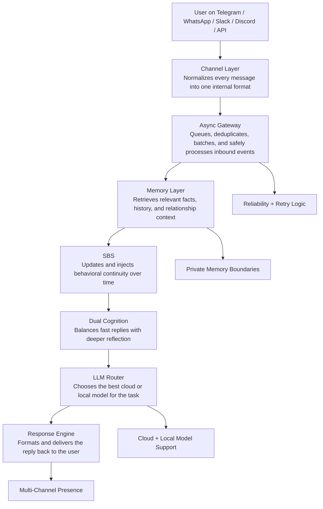
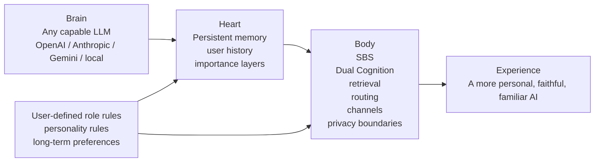

# Synapse


> **Personal AI with continuity** — multi-channel, hybrid-RAG memory, evolving behavioral profile, privacy-aware routing. Self-hostable, model-agnostic.

<!-- screenshot: docs/img/playground.png -->

## Try it in 60 seconds

```bash
docker compose -f docker-compose.demo.yml up
# then open the browser playground:
open http://localhost:8000/
```

(Need a non-Docker path or want to use your own LLM keys? See [HOW_TO_RUN.md](HOW_TO_RUN.md).)

## What it actually does

- **Multi-channel** — WhatsApp, Telegram, Discord, Slack, CLI, browser playground.
- **Hybrid RAG memory** — FastEmbed (default) or Gemini-embed, LanceDB ANN+FTS, FlashRank rerank.
- **SBS (Soul-Brain Sync)** — an evolving 8-layer behavioral profile of you, rebuilt every 50 messages from your own conversation history.
- **Dual Cognition** — an optional inner-monologue + tension-scoring pass before the LLM replies (configurable).
- **Privacy-aware routing** — sensitive topics route to a local Ollama "Vault" model; nothing about them leaves your machine.
- **Knowledge graph** — SPO triples in SQLite for entity recall (see [docs/kg-limits.md](docs/kg-limits.md)).

## How Synapse compares

| Tool | What it nails | Where Synapse differs |
|---|---|---|
| Mem0 | Drop-in memory layer for any LLM app | Synapse is a full personal-AI architecture, not a memory SDK; ships with channels, persona, routing |
| MemGPT / Letta | Long-context simulated via tiered memory | Synapse explicitly models behavioral substrate (SBS), not just facts |
| Pieces | Developer-context AI | Synapse targets personal continuity, not coding context |
| ChatGPT memory items | Polished UX, locked to OpenAI | Synapse is self-hostable, model-agnostic, multi-channel |

## Install

Copy `.env.example` to `.env` and fill in `GEMINI_API_KEY` (only required key — see [.env.example.advanced](.env.example.advanced) for the full set).

```bash
git clone https://github.com/UpayanGhosh/Synapse-OSS.git
cd Synapse-OSS
( cd workspace && pip install -r requirements.txt )    # subshell — cwd auto-restores
cp .env.example .env && $EDITOR .env
( cd workspace && python main.py chat )
```

For Docker, no-cloud, or production deploys, see [HOW_TO_RUN.md](HOW_TO_RUN.md).

## Architecture at a glance

Synapse normalizes every inbound message (WhatsApp, Telegram, Discord, Slack, CLI, browser) into a unified DTO, runs it through an async gateway (flood-batch, dedup, bounded queue, concurrent workers), enriches it with hybrid-RAG memory and an evolving behavioral profile (SBS), optionally adds a Dual Cognition pre-pass, then routes to the right model — cloud or local — based on intent and privacy classification.

See [ARCHITECTURE.md](ARCHITECTURE.md) for the full request flow, route map, and module breakdown. The multiuser keying layer is documented separately in [docs/multiuser.md](docs/multiuser.md).

## Project state

- <!--METRIC:tests--> tests across <!--METRIC:test_files--> test files (CI-substituted; `bash scripts/collect_metrics.sh` to regenerate locally).
- <!--METRIC:py_files--> Python source files.
- Single-user-per-instance today. Multi-user is planned (see PRODUCT_ISSUES.md issue 7.1).
- Solo-maintained. See [GOVERNANCE.md](GOVERNANCE.md).

Security disclosures: see [SECURITY.md](SECURITY.md).

## Vision

> Most AI is smart in the moment and forgetful across time.
>
> Synapse is built around a different idea: the model may change, but the
> relationship should not.

If ChatGPT often feels like a brilliant stranger, Synapse is trying to become
something closer to a familiar presence.

Not just an assistant.
Not just a chatbot.
Not just a thin wrapper around an LLM.

Synapse is an open-source architecture for hyperpersonalized AI:

- an interchangeable LLM brain
- a persistent memory heart
- an adaptive body of tools, routing, and behavioral logic around the model

The goal is not to build a better raw model than OpenAI, Anthropic, or Google.
The goal is to build a better body around any capable model so the AI feels more
personal, more continuous, more faithful to the user, and more alive over time.

### Why Synapse Can Feel More Human

Most AI can sound human for a few messages.

What usually breaks is everything after that:

- it forgets emotional context
- it loses the role it was supposed to play
- it stops feeling specific to the user
- it falls back into the same generic assistant tone

Synapse is trying to solve that break.

The human feeling does not come from pretending to be human.
It comes from continuity.

When an AI:

- remembers what matters
- stays faithful to the role you gave it
- understands how you prefer to be spoken to
- recognizes recurring patterns in your life
- responds differently because it knows *you*

then the interaction starts to feel less mechanical.

That is the experience Synapse is aiming for.

### In Plain English

Synapse is for people who want an AI that:

- remembers what matters
- gets better at understanding them over time
- stays faithful to the role and personality the user defines
- can respond naturally in everyday moments
- can think more deeply when the situation needs it
- can live across channels instead of one chat box
- can be self-hosted and controlled by the user
- can feel less like software and more like a familiar digital presence

This project is not trying to beat OpenAI, Anthropic, or Google at model
research.

It is trying to solve a different problem:

> How do you build an AI that feels personal, continuous, and deeply familiar
> instead of merely smart?

### Brain, Heart, And Body

The easiest way to understand Synapse is this:

- the LLM is the brain
- the database and memory system are the heart
- the architecture around them is the body

The brain can change.

A user might want Anthropic today, OpenAI next month, Gemini later, or a local
model in the future.

Synapse is designed so the core relationship does not have to reset every time
the brain changes.

That is why the real product is not just the model.

The real product is the persistent system around the model:

- memory
- role fidelity
- behavioral continuity
- retrieval
- channel presence
- privacy boundaries
- adaptive organization of user-important context

This is the real moat.

### Founder Note

Synapse started from a very simple frustration:

even the smartest AI still feels temporary.

It can impress you, help you, surprise you, and still feel like it does not
really know you.

The vision behind Synapse is to build something closer to a persistent digital
presence:

- a digital companion
- a digital brother or sister
- a reflective partner
- a caretaker
- a supervisor
- a deeply personalized assistant

not by pretending the model is magical, but by building the right heart and body
around it.

That means memory, continuity, role fidelity, adaptive structure, and enough
system depth for the relationship to survive changes in models, channels, and time.

### The Product Bet

The bet behind Synapse is simple:

> frontier models will keep changing, but users will still need continuity.

If personalization only lives inside the model vendor, the user is trapped.

If personalization lives inside Synapse, the user keeps:

- their memory
- their role definitions
- their behavioral alignment
- their long-term context
- their relationship continuity

even when the underlying model changes.

### Why People Might Care

Most current AI products are great at answering.

They are much weaker at:

- knowing you over time
- building relationship continuity
- adapting to your communication style
- remembering your long-term context
- balancing fast replies with deeper reflection

That gap is where Synapse lives.

### The Long-Term Vision

Synapse is built around a simple idea:

> A personal AI should not only answer your messages.
>
> It should gradually learn how to be more useful, more aligned, and more
> meaningful to you.

The long-term goal is an AI that feels less like software you use and more like
a digital companion that grows in context with you.

That companion might be configured as:

- a digital friend
- a digital brother or sister
- a reflective partner
- a caretaker
- a supervisor
- a personal assistant
- a role-based long-term guide

The important part is not the label.

The important part is that the AI remains faithful to the role the user wants,
instead of collapsing back into a generic assistant voice.

### What Makes Synapse Different

| What most AI feels like | What Synapse is trying to do |
| --- | --- |
| Smart in the moment | Coherent across time |
| Generic by default | More specific to one person or relationship |
| Same mode for every interaction | Fast when casual, reflective when important |
| Mostly one interface | Built to live across multiple channels |
| Closed product logic | Open-source architecture you can inspect and shape |
| Personalization as settings | Personalization as an evolving process |

### The Two Core Ideas

#### SBS

SBS is the part of Synapse that gives it continuity.

In user terms, that means:

- it can track patterns in how you speak
- it can remember what matters to you
- it can develop a more stable sense of your preferences and behavior
- it does not need to start from zero every time

In technical terms, SBS continuously distills interactions into structured
behavior and persona layers that can be injected at inference time.

#### Dual Cognition

Dual Cognition is the part of Synapse that gives it depth.

In user terms, that means:

- quick and natural replies for everyday interaction
- slower, more thoughtful reasoning when the moment is more important
- less "autocomplete energy" and more reflective response quality

In technical terms, it allows Synapse to run an internal reasoning pass before
replying and weigh current input against memory and context.

Put simply:

- SBS helps Synapse stay consistent across time
- Dual Cognition helps Synapse think with more depth in the moment

### Adaptive Architecture

Synapse is not only trying to remember the user.

It is trying to adapt its architecture around the user over time.

That does not mean uncontrolled self-modification.

It means the system should become better at organizing what matters through
bounded, user-shaped evolution:

- promoting important user facts into more durable memory structures
- separating ordinary memory from high-priority memory
- preserving role rules and long-term preferences more reliably
- recognizing repeated user signals about what should matter more
- reshaping retrieval and context assembly so the AI becomes more aligned

For example, if a user says:

> this is important, remember this for the long term

the ideal Synapse behavior is not to throw that line into the same pile as
ordinary chat history.

The ideal behavior is to treat it differently:

- classify it as high-importance memory
- preserve it more durably
- retrieve it more reliably later
- keep it separate from lower-signal conversational noise

That is the kind of adaptive architecture Synapse is aiming toward.

This is one of the most important ideas in Synapse:

> the model does not need to evolve for the experience to evolve.
>
> the architecture around the model can become more personal over time.

### Why SBS Is The Heart Of Synapse

If there is one idea at the center of Synapse, it is SBS.

Most AI systems personalize in relatively shallow ways:

- a static system prompt
- saved facts or memory snippets
- custom instructions
- recent chat history

| Problem | How Most Bots Handle It | How Synapse Handles It |
| --- | --- | --- |
| **Memory** | Stuff messages into context window until it overflows | Hybrid RAG -- SQLite knowledge graph + sqlite-vec embeddings + LanceDB vector search + FlashRank reranking. 37,868+ vocabulary terms, **<350ms P95 retrieval**, 3.4x faster than v1. Zero Docker dependency. |
| **Personality** | Static system prompt, same tone forever | Soul-Brain Sync -- a 3-stage pipeline (realtime sentiment capture, batch distillation every 50 messages, prompt injection) continuously builds a living **2KB behavioral profile**. Personality is not configured. It is learned. |
| **Model selection** | One model for everything (expensive or dumb) | Mixture of Agents -- intent classifier routes to **6 providers** (Gemini, Claude, Ollama, OpenRouter, Groq, local Vault) through `litellm.Router`. Casual chat does not burn expensive API credits. Swap providers by editing JSON config, zero code changes. |
| **Privacy** | Everything goes to cloud APIs | The Vault -- sensitive conversations route to a local Ollama model. **Hemisphere-enforced memory separation**: "safe" (cloud) and "spicy" (local-only) are physically partitioned. Zero cross-contamination, verified by automated integrity tests. |
| **Thinking** | Generate first token immediately | Dual Cognition -- generates an inner monologue, calculates a tension score (0.0--1.0) between memory and current message, then responds. It thinks before it speaks. |
| **Channels** | One messaging platform, tightly coupled | **4 channels** (WhatsApp, Telegram, Discord, Slack) normalized to a single `ChannelMessage` DTO. Memory, persona, and model routing are completely channel-blind. Adding a 5th channel requires ~100 lines -- just implement `BaseChannel`. |
| **Message reliability** | Webhook timeout, lost messages, duplicates | Async pipeline -- 3-second FloodGate batching, 5-minute deduplication window, bounded 100-task async queue, 2 concurrent MessageWorkers. **Zero dropped messages** under real load. |
| **RAM on consumer hardware** | "Just buy a bigger server" | Replaced NetworkX (155MB in-RAM graph) with SQLite (<1.2MB) after profiling showed 81% RAM pressure on 8GB hardware. Lazy-loading ToxicScorer (unloads after 30s idle), `OLLAMA_KEEP_ALIVE=0` model eviction, thermal-aware background workers. **99.2% memory reduction.** |
| **Voice** | Ignore or crash | Groq Whisper -- 2-4s cloud transcription, zero local RAM impact, then processed through the full cognitive pipeline like any other message. |

SBS is different because it is not just storing facts about the user. It is
trying to build a persistent behavioral layer:

- how you prefer to be spoken to
- how you usually reason through problems
- what kinds of responses help you most
- what emotional patterns show up repeatedly
- what topics matter to you over long periods of time

That is a deeper form of personalization than "the user likes X" or "the user
works at Y."

It is personalization at the level of behavioral continuity.

### Why That Matters To The User

When SBS is working well, the user should feel:

- less need to repeat themselves
- less friction in getting useful responses
- more sense of being understood
- more continuity from one conversation to the next
- more emotional and stylistic alignment over time

The difference is subtle but important.

A normal AI can feel smart.

An SBS-shaped AI can feel familiar.

That is a much stronger product experience.

### Why This Stands Out In The Market

Synapse is not just saying "we have memory."

A lot of AI products say that.

The stronger claim is this:

> Synapse is built around an explicit evolving behavioral substrate, not just a
> prompt, a memory list, or a chat transcript.

That is what makes SBS strategically important.

Most public AI products still present personalization as some combination of:

- custom instructions
- profile settings
- saved memory items
- retrieval from old conversations

Synapse is trying to go further by maintaining a persistent layer that shapes
how the AI interprets and responds, not just what isolated facts it can recall.

I would not make the indefensible claim that no one in the world is exploring
similar ideas internally. But as an openly described product architecture, this
is not how most public AI systems are framed today.

That makes Synapse stand out.

### Practical Example: How SBS Actually Helps

Imagine a user who has been interacting with Synapse for a few months.

Over time, Synapse has learned that this person:

- prefers direct, non-fluffy answers
- gets overwhelmed before important launches
- responds well to structured plans
- values emotional honesty more than motivational language
- often asks for strategic help late at night when stressed

Now imagine the user sends this message:

> I feel like everything is slipping. I have too many things to finish before tomorrow.

A typical AI might respond with something generic like:

> I'm sorry you're feeling overwhelmed. Try breaking your work into smaller steps and take a deep breath.

That is not wrong. It is just not very personal.

With SBS, Synapse can do something more specific.

It can recognize:

- this user usually wants clarity, not comfort-first language
- this is a recurring pre-deadline stress pattern
- the most helpful response style is probably structured, calm, and decisive

So the reply can become something more like:

> You do not need reassurance right now. You need compression.
>
> Do only three things tonight:
> 1. finish the part that blocks tomorrow
> 2. cut anything non-essential
> 3. write the first hour of tomorrow before you sleep
>
> You tend to spiral when the list stays abstract. Make it concrete and the pressure drops.

That feels different because it is different.

It is not just "AI with memory."

It is AI that has started to learn how to be useful to a specific person.

### Practical Example: How SBS And Dual Cognition Work Together

Here is the same flow in system terms:

1. The user sends a message.
2. Synapse retrieves relevant memory and recent context.
3. SBS injects behavioral continuity:
   the user prefers directness, tends to spiral under deadline stress, and responds best to structured guidance.
4. Dual Cognition evaluates the moment:
   this is not casual banter, so the system should lean toward a deeper and more deliberate response.
5. The router picks the right model.
6. The final answer reflects both memory and behavioral alignment.

That is the key distinction:

- memory tells Synapse what happened
- SBS helps Synapse understand how this person tends to work and feel
- Dual Cognition helps Synapse decide how deeply to think before replying

Together, that creates a much stronger feeling of continuity than ordinary chat history alone.

### Who Synapse Is For

Synapse is especially interesting for:

- people who want a personal AI companion
- builders exploring personalized AI systems
- researchers interested in long-term memory and human-AI continuity
- users who want more than a generic chatbot
- founders or operators who want an AI that remembers how they think
- people who care about privacy and self-hosting

### For Non-Technical Visitors

You do not need to understand the architecture to understand the promise.

The promise is simple:

- your AI should remember you
- your AI should adapt to you
- your AI should not feel the same as everyone else's
- your AI should improve through relationship, not just settings

That is what Synapse is aiming at.

### For Technical Visitors

Under the hood, Synapse already includes:

- multi-channel messaging support across WhatsApp, Telegram, Discord, and Slack
- a unified async gateway pipeline
- hybrid memory retrieval
- configurable multi-model routing across cloud and local providers
- privacy-aware routing for sensitive conversations
- SBS-based persona and behavioral modeling
- Dual Cognition reasoning flow
- voice handling
- scheduling and cron infrastructure
- reliability work for long-running channel operation

For the deeper system view, see [ARCHITECTURE.md](ARCHITECTURE.md).

### How Synapse Works

The diagram below is the short version of the system:


```mermaid
flowchart TD
    A[User on Telegram / WhatsApp / Slack / Discord / API] --> B[Channel Layer<br/>Normalizes every message into one internal format]
    B --> C[Async Gateway<br/>Queues, deduplicates, batches, and safely processes inbound events]
    C --> D[Memory Layer<br/>Retrieves relevant facts, history, and relationship context]
    D --> E[SBS<br/>Updates and injects behavioral continuity over time]
    E --> F[Dual Cognition<br/>Balances fast replies with deeper reflection]
    F --> G[LLM Router<br/>Chooses the best cloud or local model for the task]
    G --> H[Response Engine<br/>Formats and delivers the reply back to the user]

    D --> I[Private Memory Boundaries]
    G --> J[Cloud + Local Model Support]
    C --> K[Reliability + Retry Logic]
    H --> L[Multi-Channel Presence]
```

In one sentence:

> Synapse takes a message, understands it in context, blends memory with
> evolving personalization, applies the right level of reasoning, routes it to
> the right model, and returns the result through the channel the user already uses.

### Brain, Heart, Body Diagram

This is the higher-level mental model behind Synapse:


```mermaid
flowchart LR
    A[Brain<br/>Any capable LLM<br/>OpenAI / Anthropic / Gemini / local] --> B[Heart<br/>Persistent memory<br/>user history<br/>importance layers]
    B --> C[Body<br/>SBS<br/>Dual Cognition<br/>retrieval<br/>routing<br/>channels<br/>privacy boundaries]
    C --> D[Experience<br/>A more personal, faithful, familiar AI]

    E[User-defined role rules<br/>personality rules<br/>long-term preferences] --> B
    E --> C
```

The important idea is simple:

- the brain can be replaced
- the heart should persist
- the body should keep adapting around the user

### A Better Mental Model

Do not think of Synapse as "another AI app."

Think of it as:

- a personalized AI architecture
- a continuity engine for human-AI interaction
- a companion system framework
- a relationship layer on top of modern language models

### Example Use Cases

Synapse could be used as:

- a personal AI companion that becomes more aligned over time
- a reflective journaling partner that remembers your patterns
- a founder copilot that tracks your ongoing context
- a private AI that lives across Telegram, Slack, and other channels
- a research platform for long-term personalization in AI

### Why Open Source Matters Here

Personalized AI is too important to exist only as black-box products.

If an AI is going to:

- remember your life
- learn your preferences
- infer patterns about how you think
- become increasingly central to your daily experience

then people should be able to inspect, self-host, modify, and question how that
system works.

That is one of the strongest reasons Synapse exists as an open-source project.

### If You Are Watching This Space

If you care about:

- personalized AI
- companion systems
- AI that develops continuity
- long-term memory architectures
- reflective AI behavior
- self-hosted alternatives to closed personal AI products

then Synapse is worth paying attention to.

## Contributing

See [CONTRIBUTING.md](CONTRIBUTING.md) and [GOVERNANCE.md](GOVERNANCE.md).

---

## OpenClaw -- Acknowledgements and Inspiration

Synapse was originally built on top of [OpenClaw](https://github.com/nicepkg/openclaw)'s gateway infrastructure, and the influence runs deep.

OpenClaw's approach to local AI tooling -- treating the terminal as a first-class AI interface -- shaped how Synapse thinks about the relationship between the AI brain and its communication channels. The idea that your AI assistant should run on your machine, respect your data, and work through whatever interface you prefer did not originate with Synapse. It came from using OpenClaw daily and internalizing its philosophy.

As Synapse's requirements grew -- multi-channel support, custom LLM routing through litellm, self-hosted hybrid memory, evolving persona profiles -- we built our own Baileys bridge, litellm router, and channel abstraction layer. The system outgrew the original gateway dependency. But the original inspiration and architectural direction came from OpenClaw.

Deep respect and gratitude to the OpenClaw creators. The spirit of "run your own AI, control your own data" lives on in Synapse's privacy-first design: The Vault, hemisphere enforcement, the zero-cloud-leakage guarantee, and the conviction that a personal AI assistant should be exactly that -- personal.

---

## Built By

**Upayan Ghosh** -- Software engineer who built a 15,000+ line production AI system from scratch, on evenings and weekends, on consumer hardware.

This project was built using AI coding tools (Claude, ChatGPT, Gemini) for implementation, with architecture design, system integration, performance profiling, and debugging done by hand. The architectural decisions -- replacing NetworkX with SQLite after profiling RAM pressure, designing the channel abstraction layer, building hemisphere-enforced memory isolation, engineering the SBS pipeline -- those came from staring at real problems and solving them.

I believe in using every tool available to build things that work.

- GitHub: [@UpayanGhosh](https://github.com/UpayanGhosh)
- LinkedIn: [https://linkedin.com/in/upayan](https://linkedin.com/in/upayan)
- Email: [upayan1231@gmail.com](mailto:upayan1231@gmail.com)

**Currently open to:** Backend/AI engineering roles, freelance AI/chatbot projects, and conversations about RAG systems, async architectures, and privacy-first AI design.

---

## Contributors

Thanks to these people for making Synapse better:

| Contributor | Contribution |
| --- | --- |
| [@Aniruddha775](https://github.com/Aniruddha775) | Recursive CTE path search for knowledge graph ([#26](https://github.com/UpayanGhosh/Synapse-OSS/pull/26)) |

Want to contribute? Check out [CONTRIBUTING.md](CONTRIBUTING.md) to get started.

---

## Documentation

| Document | Description |
| --- | --- |
| [ARCHITECTURE.md](ARCHITECTURE.md) | Full system architecture with Mermaid diagrams |
| [HOW_TO_RUN.md](HOW_TO_RUN.md) | Complete setup and deployment guide |
| [SETUP_PERSONA.md](SETUP_PERSONA.md) | Persona customization guide |
| [docs/multiuser.md](docs/multiuser.md) | Multiuser keying and identity layer |
| [docs/kg-limits.md](docs/kg-limits.md) | Knowledge graph scope and limits |
| [SECURITY.md](SECURITY.md) | Security disclosure policy |
| [GOVERNANCE.md](GOVERNANCE.md) | Project governance and maintainership |
| [CONTRIBUTING.md](CONTRIBUTING.md) | Dev setup, test commands, and PR guidelines |
| [CODE_OF_CONDUCT.md](CODE_OF_CONDUCT.md) | Community code of conduct |
