# JARVIS Phoenix v3 — Mermaid Architecture Diagram

> **How to use this with Figma:**
> 1. Install the [Mermaid to Figma plugin](https://www.figma.com/community/plugin/1150536131435213601/mermaid).
> 2. Copy the entire code block below (excluding the triple backticks).
> 3. Paste it into the plugin and hit Generate.

```mermaid
graph LR
    %% Styling Classes
    classDef user fill:#2d3436,stroke:#74b9ff,stroke-width:2px,color:#fff
    classDef gateway fill:#0984e3,stroke:#74b9ff,stroke-width:3px,color:#fff
    classDef async fill:#00cec9,stroke:#81ecec,stroke-width:2px,color:#000
    classDef memory fill:#00b894,stroke:#55efc4,stroke-width:2px,color:#fff
    classDef sbs fill:#fdcb6e,stroke:#f39c12,stroke-width:2px,color:#000
    classDef moa fill:#6c5ce7,stroke:#a29bfe,stroke-width:2px,color:#fff
    classDef local fill:#d63031,stroke:#ff7675,stroke-width:2px,color:#fff

    %% --- SECTION 1: INGRESS (LEFT) ---
    subgraph Inputs ["User Inputs"]
        direction TB
        U1["📱 WhatsApp Webhook<br/>Node Gateway"]:::user
        U2["💻 OpenClaw CLI<br/>Proxy Request"]:::user
    end

    %% --- SECTION 2: ASYNC PIPELINE (LEFT-CENTER) ---
    subgraph Async_Pipeline ["Async Gateway Pipeline"]
        direction LR
        FG{"🛡️ FloodGate<br/>Batch Window 3s"}:::async
        DD["🔁 MessageDeduplicator<br/>5-min window"]:::async
        Q["📦 TaskQueue<br/>max 100"]:::async
        W["⚙️ MessageWorker<br/>2 concurrent"]:::async
        
        FG --> DD
        DD --> Q
        Q --> W
    end

    %% --- SECTION 3: CORE GATEWAY (CENTER) ---
    G(("🚀 Core API Gateway<br/>FastAPI / Uvicorn<br/>:8000")):::gateway

    %% Connections into Gateway
    U1 -->|"HTTP POST /webhook"| FG
    U2 -->|"CLI Proxy"| G
    W --> G

    %% --- SECTION 4: CONTEXT & MEMORY (ABOVE GATEWAY) ---
    %% Placed above to show they are background services supporting the Gateway
    subgraph Brain_Context ["🤖 Context Engine"]
        direction TB
        subgraph SBS ["Soul-Brain Sync — Persona Engine"]
            SBS_O["🎭 SBS Orchestrator"]:::sbs
            SBS_P["📋 Profile Manager"]:::sbs
            SBS_L["📝 Conversation Logger"]:::sbs
            SBS_RT["⚡ Realtime Processor"]:::sbs
            SBS_B["🔄 Batch Processor"]:::sbs
            SBS_C["🖊️ Prompt Compiler"]:::sbs
            
            SBS_O --- SBS_P
            SBS_P --- SBS_L
            SBS_O --- SBS_RT
            SBS_RT --- SBS_B
            SBS_O --- SBS_C
        end

        subgraph Cognitive_Memory ["💾 Cognitive Memory"]
            ME["🧠 Memory Engine<br/>Hybrid Retrieval v3"]:::memory
            M1["🗃️ SQLite Graph DB"]:::memory
            M2["🔷 Qdrant Vector DB"]:::memory
            RE["🏅 FlashRank Reranker"]:::memory
            
            ME <--> M1
            ME <--> M2
            ME --> RE
        end

        subgraph Dual_Cognition ["🧩 Dual Cognition"]
            DC["🧩 DualCognitionEngine"]:::memory
            TS["☣️ LazyToxicScorer"]:::memory
            DC --- TS
        end
    end

    %% Connections from Gateway to Context
    G <-->|"Inject Persona Context"| SBS_O
    G <-->|"Semantic + Graph Query"| ME
    G -->|"Tension Check"| DC


    %% --- SECTION 5: MOA AGENTS (RIGHT) ---
    subgraph Mixture_of_Agents ["🚀 Mixture of Agents"]
        direction TB
        TC{"🚦 Traffic Cop<br/>Intent Classifier"}:::moa
        
        subgraph Agents ["LLM Agents"]
            direction LR
            LLM1["🟢 Gemini 3 Flash<br/>(CASUAL)"]:::moa
            LLM2["💻 The Hacker<br/>(CODING)"]:::moa
            LLM3["🏛️ The Architect<br/>(ANALYSIS)"]:::moa
            LLM4["🧐 The Philosopher<br/>(REVIEW)"]:::moa
            LLM5["🌶️ The Vault<br/>(SPICY)"]:::local
        end

        TC -->|"CASUAL"| LLM1
        TC -->|"CODING"| LLM2
        TC -->|"ANALYSIS"| LLM3
        TC -->|"REVIEW"| LLM4
        TC -->|"SPICY"| LLM5
    end

    %% --- SECTION 6: RETURN PATH (RIGHT) ---
    G -->|"Classify Intent"| TC
    
    LLM1 -->|"Response + Stats"| G
    LLM2 -->|"Response + Stats"| G
    LLM3 -->|"Response + Stats"| G
    LLM4 -->|"Response + Stats"| G
    LLM5 -->|"Response + Stats"| G

    G -->|"Auto-Continue if cut-off"| AC["✂️ Auto-Continue"]:::async
    G -->|"Final Output"| Out["📨 Output"]:::user

    %% Link Output back to Inputs conceptually (or just show direction)
    AC -.->|"continues..."| G

```

